# Changelog

All notable changes to this project will be documented in this file.

The format is based on [Keep a Changelog](https://keepachangelog.com/en/1.0.0/),
and this project adheres to [Semantic Versioning](https://semver.org/spec/v2.0.0.html).

## Unreleased

## [0.26.3] - 2024-06-02

### Breaking Changes

#### Theme file format

**note:** this actually applied to the previous release already: `0.26.2`

Ratatui (upstream terminal rendering crate) changed its serialization format for Colors. So the theme files have to be adjusted.

`selection_fg: Some(White)` -> `selection_fg: Some("White")`

but this also allows us now to define colors in the common hex format:

`selection_fg: Some(Rgb(0,255,0))` -> `selection_fg: Some("#00ff00")`

Checkout [THEMES.md](./THEMES.md) for more info.

### Added
* due to github runner changes, the regular mac build is now arm64, so we added support for intel x86 apple build in nightlies and releases (via separat artifact)
* support `BUILD_GIT_COMMIT_ID` enabling builds from `git archive` generated source tarballs or other outside a git repo [[@alerque](https://github.com/alerque)] ([#2187](https://github.com/extrawurst/gitui/pull/2187))

### Fixes
* update yanked dependency to `libc` to fix building with `--locked`.
* document breaking change in theme file format.

## [0.26.2] - 2024-04-17

**note:** this release introduced a breaking change documented in the following release: `0.26.3`

### Fixes
* fix `cargo install` without `--locked` ([#2098](https://github.com/extrawurst/gitui/issues/2098))
* respect configuration for remote when fetching (also applies to pulling) [[@cruessler](https://github.com/cruessler)] ([#1093](https://github.com/extrawurst/gitui/issues/1093))
* add `:` character to sign-off trailer to comply with Conventinoal Commits standard [@semioticrobotic](https://github.com/semioticrobotic) ([#2196](https://github.com/extrawurst/gitui/issues/2196))

### Added
* support overriding `build_date` for [reproducible builds](https://reproducible-builds.org/) [[@bmwiedemann](https://github.com/bmwiedemann)] ([#2202](https://github.com/extrawurst/gitui/pull/2202))

## [0.26.0+1] - 2024-04-14

**0.26.1**
this release has no changes to `0.26.0` but provides windows binaries that were missing before.

**commit signing**

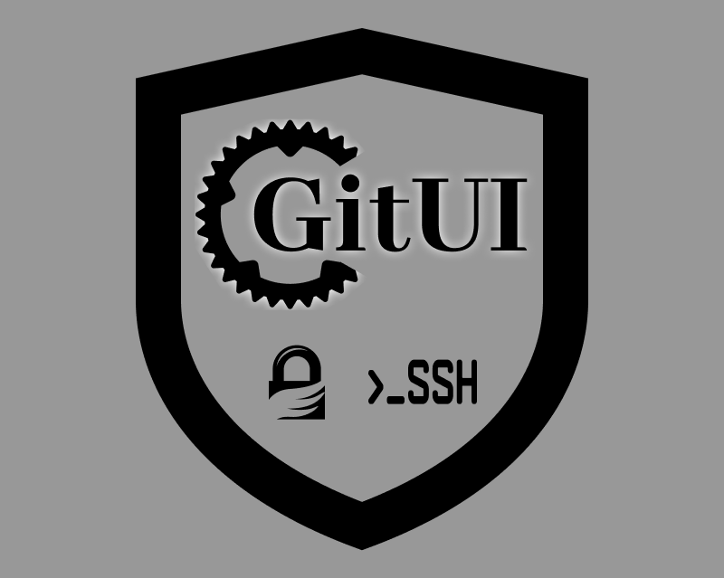

### Added
* sign commits using openpgp [[@hendrikmaus](https://github.com/hendrikmaus)] ([#97](https://github.com/extrawurst/gitui/issues/97))
* support ssh commit signing (when `user.signingKey` and `gpg.format = ssh` of gitconfig are set; ssh-agent isn't yet supported)  [[@yanganto](https://github.com/yanganto)] ([#1149](https://github.com/extrawurst/gitui/issues/1149))
* provide nightly builds (see [NIGHTLIES.md](./NIGHTLIES.md)) ([#2083](https://github.com/extrawurst/gitui/issues/2083))
* more version info in `gitui -V` and `help popup` (including git hash)
* support `core.commitChar` filtering [[@concelare](https://github.com/concelare)] ([#2136](https://github.com/extrawurst/gitui/issues/2136))
* allow reset in branch popup ([#2170](https://github.com/extrawurst/gitui/issues/2170))
* respect configuration for remote when pushing [[@cruessler](https://github.com/cruessler)] ([#2156](https://github.com/extrawurst/gitui/issues/2156))

### Changed
* Make info and error message popups scrollable [[@MichaelAug](https://github.com/MichaelAug)] ([#1138](https://github.com/extrawurst/gitui/issues/1138))
* clarify `x86_64` linux binary in artifact names: `gitui-linux-x86_64.tar.gz` (formerly known as `musl`) ([#2148](https://github.com/extrawurst/gitui/issues/2148))

### Fixes
* add syntax highlighting support for more file types, e.g. Typescript, TOML, etc. [[@martihomssoler](https://github.com/martihomssoler)] ([#2005](https://github.com/extrawurst/gitui/issues/2005))
* windows release deployment was broken (reason for release `0.26.1`) [218d739](https://github.com/extrawurst/gitui/commit/218d739b035a034b7bf547629d24787909f467bf)

## [0.25.2] - 2024-03-22

### Fixes
* blame sometimes crashed due to new syntax highlighting [[@tdtrung17693](https://github.com/tdtrung17693)] ([#2130](https://github.com/extrawurst/gitui/issues/2130))
* going to file tree view at certin commit from the commit-details view broke [[@martihomssoler](https://github.com/martihomssoler)] ([#2114](https://github.com/extrawurst/gitui/issues/2114))
* `0.25` broke creating annotated tags ([#2126](https://github.com/extrawurst/gitui/issues/2126))

### Changed
* re-enable clippy `missing_const_for_fn` linter warning and added const to functions where applicable ([#2116](https://github.com/extrawurst/gitui/issues/2116))

## [0.25.1] - 2024-02-23

### Fixes
* bump yanked dependency `bumpalo` to fix build from source ([#2087](https://github.com/extrawurst/gitui/issues/2087))
* pin `ratatui` version to fix building without locked `cargo install gitui` ([#2090](https://github.com/extrawurst/gitui/issues/2090))

## [0.25.0] - 2024-02-21

** multiline text editor **

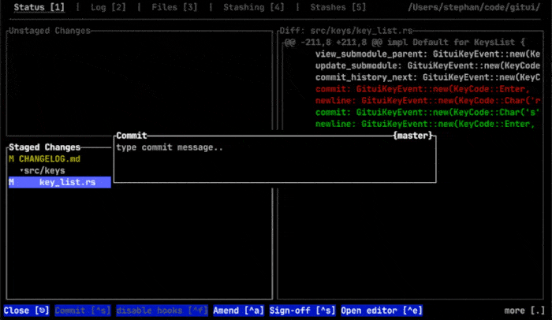

** syntax highlighting in blame **

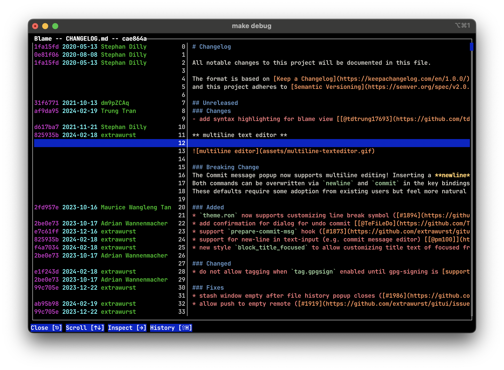

### Breaking Change

#### commit key binding

The Commit message popup now supports multiline editing! Inserting a **newline** defaults to `enter`. This comes with a new default to confirm the commit message (`ctrl+d`).
Both commands can be overwritten via `newline` and `commit` in the key bindings. see [KEY_CONFIG](./KEY_CONFIG.md) on how.
These defaults require some adoption from existing users but feel more natural to new users.

#### key binding bitflags

Modifiers like `SHIFT` or `CONTROL` are no longer configured via magic bitflags but via strings thanks to changes in the [bitflags crate](https://github.com/bitflags/bitflags/blob/main/CHANGELOG.md#changes-to-serde-serialization) we depend on. Please see [KEY_CONFIG.md](./KEY_CONFIG.md) or [vim_style_key_config.ron](./vim_style_key_config.ron) for more info and examples.

### Added
* support for new-line in text-input (e.g. commit message editor) [[@pm100]](https://github/pm100) ([#1662](https://github.com/extrawurst/gitui/issues/1662)).
* add syntax highlighting for blame view [[@tdtrung17693](https://github.com/tdtrung17693)] ([#745](https://github.com/extrawurst/gitui/issues/745))
* allow aborting pending commit log search [[@StemCll](https://github.com/StemCll)] ([#1860](https://github.com/extrawurst/gitui/issues/1860))
* `theme.ron` now supports customizing line break symbol ([#1894](https://github.com/extrawurst/gitui/issues/1894))
* add confirmation for dialog for undo commit [[@TeFiLeDo](https://github.com/TeFiLeDo)] ([#1912](https://github.com/extrawurst/gitui/issues/1912))
* support `prepare-commit-msg` hook ([#1873](https://github.com/extrawurst/gitui/issues/1873))
* new style `block_title_focused` to allow customizing title text of focused frame/block ([#2052](https://github.com/extrawurst/gitui/issues/2052)).
* allow `fetch` command in both tabs of branchlist popup ([#2067](https://github.com/extrawurst/gitui/issues/2067))
* check branch name validity while typing [[@sainad2222](https://github.com/sainad2222)] ([#2062](https://github.com/extrawurst/gitui/issues/2062))

### Changed
* do not allow tagging when `tag.gpgsign` enabled until gpg-signing is [supported](https://github.com/extrawurst/gitui/issues/97) [[@TeFiLeDo](https://github.com/TeFiLeDo)] ([#1915](https://github.com/extrawurst/gitui/pull/1915))

### Fixes
* stash window empty after file history popup closes ([#1986](https://github.com/extrawurst/gitui/issues/1986))
* allow push to empty remote ([#1919](https://github.com/extrawurst/gitui/issues/1919))
* better diagnostics for theme file loading ([#2007](https://github.com/extrawurst/gitui/issues/2007))
* fix ordering of commits in diff view [[@Joshix-1](https://github.com/Joshix-1)]([#1747](https://github.com/extrawurst/gitui/issues/1747))

## [0.24.3] - 2023-09-09

### Fixes
* log: major lag when going beyond last search hit ([#1876](https://github.com/extrawurst/gitui/issues/1876))

### Changed
* parallelise log search - performance gain ~100% ([#1869](https://github.com/extrawurst/gitui/issues/1869))
* search message body/summary separately ([#1875](https://github.com/extrawurst/gitui/issues/1875))

## [0.24.2] - 2023-09-03

### Fixes
* fix commit log not updating after branch switch ([#1862](https://github.com/extrawurst/gitui/issues/1862))
* fix stashlist not updating after pop/drop ([#1864](https://github.com/extrawurst/gitui/issues/1864))
* fix commit log corruption when tabbing in/out while parsing log ([#1866](https://github.com/extrawurst/gitui/issues/1866))

## [0.24.1] - 2023-08-30

### Fixes
* fix performance problem in big repo with a lot of incoming commits ([#1845](https://github.com/extrawurst/gitui/issues/1845))
* fix error switching to a branch with '/' in the name ([#1851](https://github.com/extrawurst/gitui/issues/1851))

## [0.24.0] - 2023-08-27

**search commits**

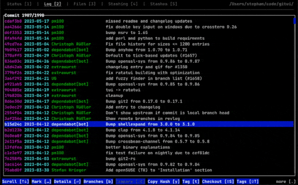

**visualize empty lines in diff better**

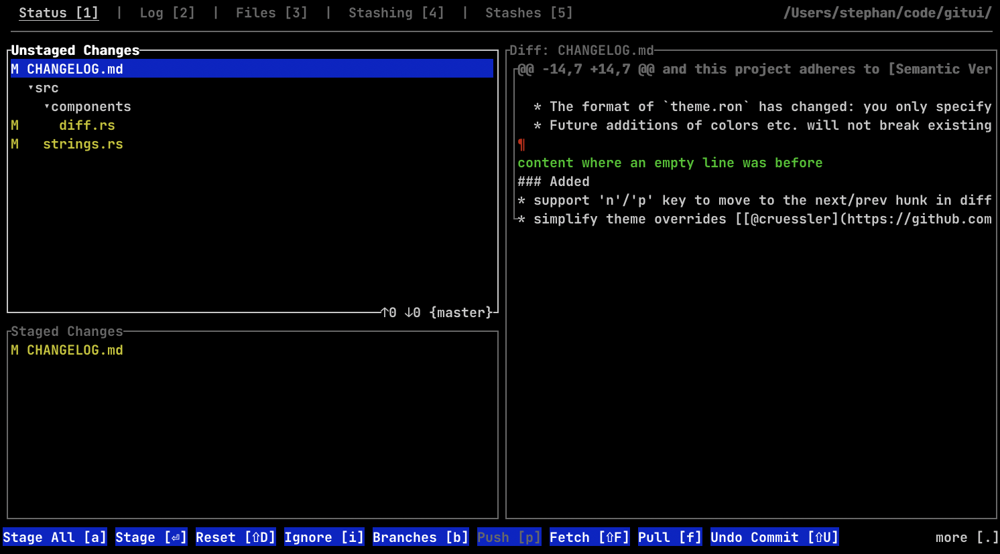

### Breaking Changes
* Do you use a custom theme?

  The way themes work got changed and simplified ([see docs](https://github.com/extrawurst/gitui/blob/master/THEMES.md) for more info):

  * The format of `theme.ron` has changed: you only specify the colors etc. that should differ from their default value
  * Future additions of colors etc. will not break existing themes anymore

### Added
* search commits by message, author or files in diff ([#1791](https://github.com/extrawurst/gitui/issues/1791))
* support 'n'/'p' key to move to the next/prev hunk in diff component [[@hamflx](https://github.com/hamflx)] ([#1523](https://github.com/extrawurst/gitui/issues/1523))
* simplify theme overrides [[@cruessler](https://github.com/cruessler)] ([#1367](https://github.com/extrawurst/gitui/issues/1367))
* support for sign-off of commits [[@domtac](https://github.com/domtac)]([#1757](https://github.com/extrawurst/gitui/issues/1757))
* switched from textwrap to bwrap for text wrapping [[@TheBlackSheep3](https://github.com/TheBlackSheep3/)] ([#1762](https://github.com/extrawurst/gitui/issues/1762))
* more logging diagnostics when a repo cannot be opened
* added to [anaconda](https://anaconda.org/conda-forge/gitui) [[@TheBlackSheep3](https://github.com/TheBlackSheep3/)] ([#1626](https://github.com/extrawurst/gitui/issues/1626))
* visualize empty line substituted with content in diff better ([#1359](https://github.com/extrawurst/gitui/issues/1359))
* checkout branch works with non-empty status report [[@lightsnowball](https://github.com/lightsnowball)]  ([#1399](https://github.com/extrawurst/gitui/issues/1399))
* jump to commit by SHA [[@AmmarAbouZor](https://github.com/AmmarAbouZor)] ([#1818](https://github.com/extrawurst/gitui/pull/1818))

### Fixes
* fix commit dialog char count for multibyte characters ([#1726](https://github.com/extrawurst/gitui/issues/1726))
* fix wrong hit highlighting in fuzzy find popup [[@UUGTech](https://github.com/UUGTech)] ([#1731](https://github.com/extrawurst/gitui/pull/1731))
* fix symlink support for configuration files [[@TheBlackSheep3](https://github.com/TheBlackSheep3)] ([#1751](https://github.com/extrawurst/gitui/issues/1751))
* fix expansion of `~` in `commit.template` ([#1745](https://github.com/extrawurst/gitui/pull/1745))
* fix hunk (un)staging/reset for # of context lines != 3 ([#1746](https://github.com/extrawurst/gitui/issues/1746))
* fix delay when opening external editor ([#1506](https://github.com/extrawurst/gitui/issues/1506))

### Changed
* Copy full Commit Hash by default [[@AmmarAbouZor](https://github.com/AmmarAbouZor)] ([#1836](https://github.com/extrawurst/gitui/issues/1836))

## [0.23.0] - 2023-06-19

**reset to commit**

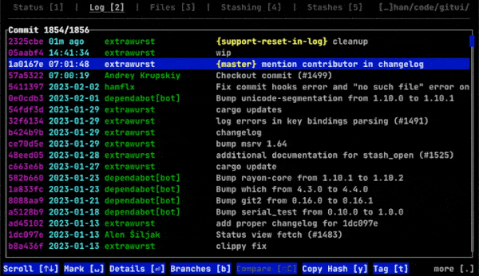

**reword commit**

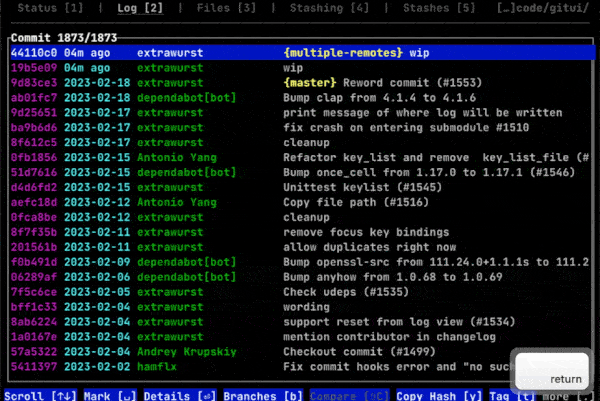

**fuzzy find branch**

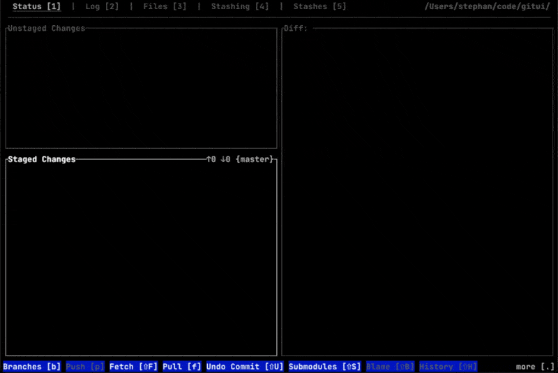

### Breaking Change
* `focus_XYZ` key bindings are merged into the `move_XYZ` set, so only one way to bind arrow-like keys from now on ([#1539](https://github.com/extrawurst/gitui/issues/1539))

### Added
* allow reset (soft,mixed,hard) from commit log ([#1500](https://github.com/extrawurst/gitui/issues/1500))
* support **reword** of commit from log ([#829](https://github.com/extrawurst/gitui/pull/829))
* fuzzy find branch [[@UUGTech](https://github.com/UUGTech)] ([#1350](https://github.com/extrawurst/gitui/issues/1350))
* list changes in commit message inside external editor [[@bc-universe]](https://github.com/bc-universe) ([#1420](https://github.com/extrawurst/gitui/issues/1420))
* allow detaching HEAD and checking out specific commit from log view [[@fralcow]](https://github.com/fralcow) ([#1499](https://github.com/extrawurst/gitui/pull/1499))
* add no-verify option on commits to not run hooks [[@dam5h]](https://github.com/dam5h) ([#1374](https://github.com/extrawurst/gitui/issues/1374))
* allow `fetch` on status tab [[@alensiljak]](https://github.com/alensiljak) ([#1471](https://github.com/extrawurst/gitui/issues/1471))
* allow `copy` file path on revision files and status tree [[@yanganto]](https://github.com/yanganto)  ([#1516](https://github.com/extrawurst/gitui/pull/1516))
* print message of where log will be written if `-l` is set ([#1472](https://github.com/extrawurst/gitui/pull/1472))
* show remote branches in log [[@cruessler](https://github.com/cruessler)] ([#1501](https://github.com/extrawurst/gitui/issues/1501))
* scrolling functionality to fuzzy-find [[@AmmarAbouZor](https://github.com/AmmarAbouZor)] ([#1732](https://github.com/extrawurst/gitui/issues/1732))

### Fixes
* fixed side effect of crossterm 0.26 on windows that caused double input of all keys [[@pm100]](https://github/pm100) ([#1686](https://github.com/extrawurst/gitui/pull/1686))
* commit msg history ordered the wrong way ([#1445](https://github.com/extrawurst/gitui/issues/1445))
* improve help documentation for amend cmd ([#1448](https://github.com/extrawurst/gitui/issues/1448))
* lag issue when showing files tab ([#1451](https://github.com/extrawurst/gitui/issues/1451))
* fix key binding shown in bottom bar for `stash_open` ([#1454](https://github.com/extrawurst/gitui/issues/1454))
* `--bugreport` does not require param ([#1466](https://github.com/extrawurst/gitui/issues/1466))
* `edit`-file command shown on commits msg ([#1461](https://github.com/extrawurst/gitui/issues/1461))
* crash on branches popup in small terminal ([#1470](https://github.com/extrawurst/gitui/issues/1470))
* `edit` command duplication ([#1489](https://github.com/extrawurst/gitui/issues/1489))
* syntax errors in `key_bindings.ron` will be logged ([#1491](https://github.com/extrawurst/gitui/issues/1491))
* Fix UI freeze when copying with xclip installed on Linux ([#1497](https://github.com/extrawurst/gitui/issues/1497))
* Fix UI freeze when copying with wl-copy installed on Linux ([#1497](https://github.com/extrawurst/gitui/issues/1497))
* commit hooks report "command not found" on Windows with wsl2 installed ([#1528](https://github.com/extrawurst/gitui/issues/1528))
* crashes on entering submodules ([#1510](https://github.com/extrawurst/gitui/issues/1510))
* fix race issue: revlog messages sometimes appear empty ([#1473](https://github.com/extrawurst/gitui/issues/1473))
* default to tick-based updates [[@cruessler](https://github.com/cruessler)] ([#1444](https://github.com/extrawurst/gitui/issues/1444))
* add support for options handling in log and stashes views [[@kamillo](https://github.com/kamillo)] ([#1661](https://github.com/extrawurst/gitui/issues/1661))

### Changed
* minimum supported rust version bumped to 1.65 (thank you `time` crate)

## [0.22.1] - 2022-11-22

Bugfix followup release - check `0.22.0` notes for more infos!

### Added
* new arg `--polling` to use poll-based change detection and not filesystem watcher (use if you see problems running into file descriptor limits)

### Fixes
* improve performance by requesting branches info asynchronous ([92f63d1](https://github.com/extrawurst/gitui/commit/92f63d107c1dca1f10139668ff5b3ca752261b0f))
* fix app startup delay due to using file watcher ([#1436](https://github.com/extrawurst/gitui/issues/1436))
* make git tree file fetch async ([#734](https://github.com/extrawurst/gitui/issues/734))

## [0.22.0] - 2022-11-19

**submodules view**

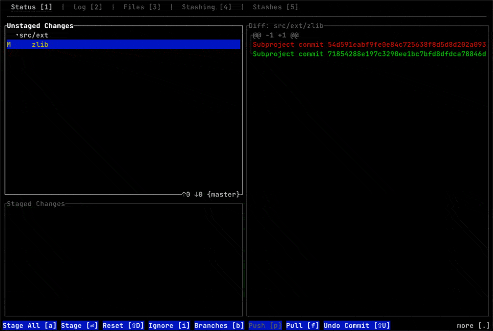

**commit message history**

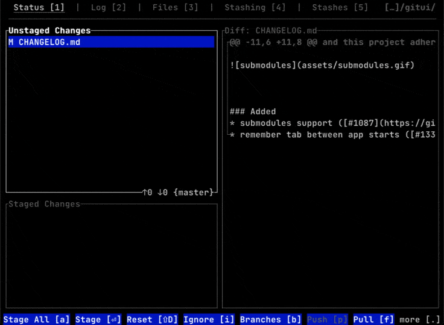

### Added
* submodules support ([#1087](https://github.com/extrawurst/gitui/issues/1087))
* remember tab between app starts ([#1338](https://github.com/extrawurst/gitui/issues/1338))
* repo specific gitui options saved in `.git/gitui.ron` ([#1340](https://github.com/extrawurst/gitui/issues/1340))
* commit msg history ([#1345](https://github.com/extrawurst/gitui/issues/1345))
* customizable `cmdbar_bg` theme color & screen spanning selected line bg [[@gigitsu](https://github.com/gigitsu)] ([#1299](https://github.com/extrawurst/gitui/pull/1299))
* word motions to text input [[@Rodrigodd](https://github.com/Rodrigodd)] ([#1256](https://github.com/extrawurst/gitui/issues/1256))
* file blame at right revision from commit-details [[@heiskane](https://github.com/heiskane)] ([#1122](https://github.com/extrawurst/gitui/issues/1122))
* dedicated selection foreground theme color `selection_fg` ([#1365](https://github.com/extrawurst/gitui/issues/1365))
* add `regex-fancy` and `regex-onig` features to allow building Syntect with Onigumara regex engine instead of the default engine based on fancy-regex [[@jirutka](https://github.com/jirutka)]
* add `vendor-openssl` feature to allow building without vendored openssl [[@jirutka](https://github.com/jirutka)]
* allow copying marked commits [[@remique](https://github.com/remique)] ([#1288](https://github.com/extrawurst/gitui/issues/1288))
* feedback for success/failure of copying hash commit [[@sergioribera](https://github.com/sergioribera)]([#1160](https://github.com/extrawurst/gitui/issues/1160))
* display tags and branches in the log view [[@alexmaco](https://github.com/alexmaco)] ([#1371](https://github.com/extrawurst/gitui/pull/1371))
* display current repository path in the top-right corner [[@alexmaco](https://github.com/alexmaco)]([#1387](https://github.com/extrawurst/gitui/pull/1387))
* add Linux targets for ARM, ARMv7 and AARCH64 [[@adur1990](https://github.com/adur1990)] ([#1419](https://github.com/extrawurst/gitui/pull/1419))
* display commit description in file view [[@alexmaco](https://github.com/alexmaco)] ([#1380](https://github.com/extrawurst/gitui/pull/1380))
* allow launching editor from Compare Commits view ([#1409](https://github.com/extrawurst/gitui/pull/1409))

### Fixes
* remove insecure dependency `ansi_term` ([#1290](https://github.com/extrawurst/gitui/issues/1290))
* use filewatcher instead of polling updates ([#1](https://github.com/extrawurst/gitui/issues/1))

## [0.21.0] - 2022-08-17

**popup stacking**

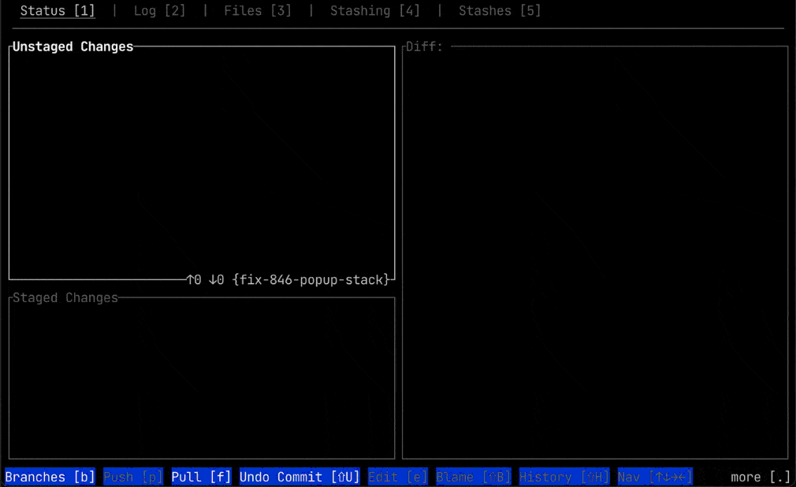

**termux android support**

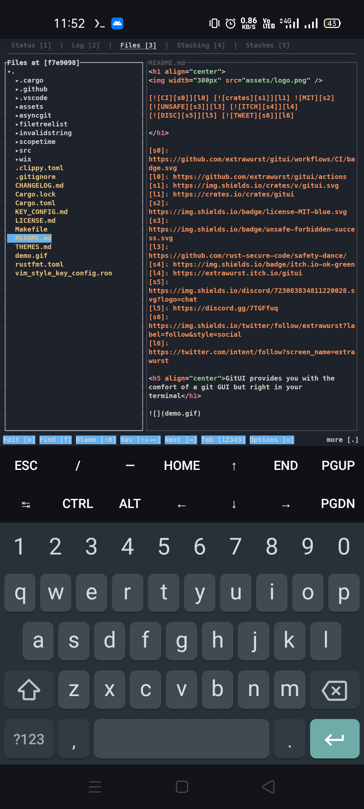

### Added
* stack popups ([#846](https://github.com/extrawurst/gitui/issues/846))
* file history log [[@cruessler](https://github.com/cruessler)] ([#381](https://github.com/extrawurst/gitui/issues/381))
* termux support on android [[@PeroSar](https://github.com/PeroSar)] ([#1139](https://github.com/extrawurst/gitui/issues/1139))
* use `GIT_DIR` and `GIT_WORK_DIR` from environment if set ([#1191](https://github.com/extrawurst/gitui/pull/1191))
* new [FAQ](./FAQ.md)s page
* mention macports in install section [[@fs111](https://github.com/fs111)]([#1237](https://github.com/extrawurst/gitui/pull/1237))
* support copy to clipboard on wayland [[@JayceFayne](https://github.com/JayceFayne)] ([#397](https://github.com/extrawurst/gitui/issues/397))

### Fixed
* opening tags list without remotes ([#1111](https://github.com/extrawurst/gitui/issues/1111))
* tabs indentation in blame [[@fersilva16](https://github.com/fersilva16)] ([#1117](https://github.com/extrawurst/gitui/issues/1117))
* switch focus to index after staging last file ([#1169](https://github.com/extrawurst/gitui/pull/1169))
* fix stashlist multi marking not updated after dropping ([#1207](https://github.com/extrawurst/gitui/pull/1207))
* exact matches have a higher priority and are placed to the top of the list when fuzzily finding files ([#1183](https://github.com/extrawurst/gitui/pull/1183))
* support horizontal scrolling in diff view ([#1017](https://github.com/extrawurst/gitui/issues/1017))

### Changed
* minimum supported rust version bumped to 1.60 ([#1279](https://github.com/extrawurst/gitui/pull/1279))

## [0.20.1] - 2022-01-26

This is was a immediate followup patch release to `0.20` see [release notes](https://github.com/extrawurst/gitui/releases/tag/v0.20.0) for the whole list of goodies in `0.20`.

### Added
* support proxy auto detection via env's like `HTTP_PROXY` ([#994](https://github.com/extrawurst/gitui/issues/994))

### Fixed
* severe performance regression in `0.20` ([#1102](https://github.com/extrawurst/gitui/issues/1102))
* several smaller performance improvements via caching ([#1104](https://github.com/extrawurst/gitui/issues/1104))
* windows release deployment via CD broken

## [0.20] - 2022-01-25 - Tag Annotations

**support tag annotations**

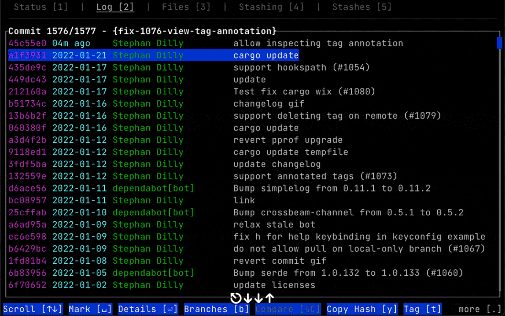

**delete tag on remote**

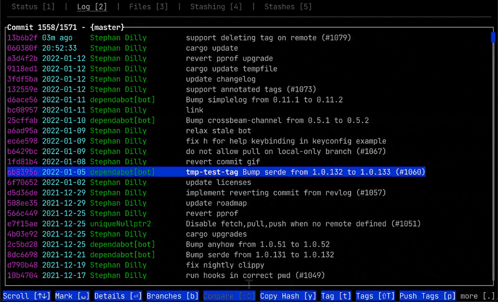

**revert commit from rev log**

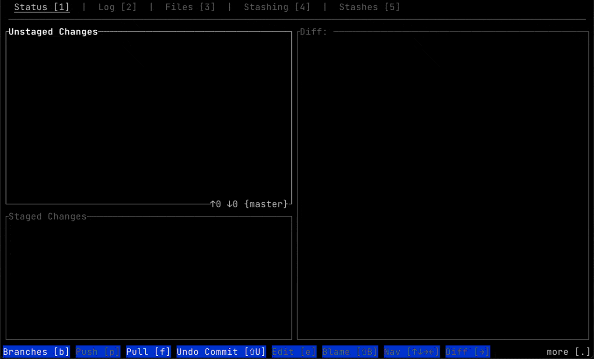

### Added
- support `core.hooksPath` ([#1044](https://github.com/extrawurst/gitui/issues/1044))
- allow reverting a commit from the commit log ([#927](https://github.com/extrawurst/gitui/issues/927))
- disable pull cmd on local-only branches ([#1047](https://github.com/extrawurst/gitui/issues/1047))
- support adding annotations to tags ([#747](https://github.com/extrawurst/gitui/issues/747))
- support inspecting annotation of tag ([#1076](https://github.com/extrawurst/gitui/issues/1076))
- support deleting tag on remote ([#1074](https://github.com/extrawurst/gitui/issues/1074))
- support git credentials helper (https) ([#800](https://github.com/extrawurst/gitui/issues/800))

### Fixed
- Keep commit message when pre-commit hook fails ([#1035](https://github.com/extrawurst/gitui/issues/1035))
- honor `pushurl` when checking credentials for pushing ([#953](https://github.com/extrawurst/gitui/issues/953))
- use git-path instead of workdir finding hooks ([#1046](https://github.com/extrawurst/gitui/issues/1046))
- only enable remote actions (fetch/pull/push) if there are remote branches ([#1047](https://github.com/extrawurst/gitui/issues/1047))

### Key binding notes
- added `gg`/`G` vim bindings to `vim_style_key_config.ron` ([#1039](https://github.com/extrawurst/gitui/issues/1039))

## [0.19] - 2021-12-08 - Bare Repo Support

**finder highlighting matches**

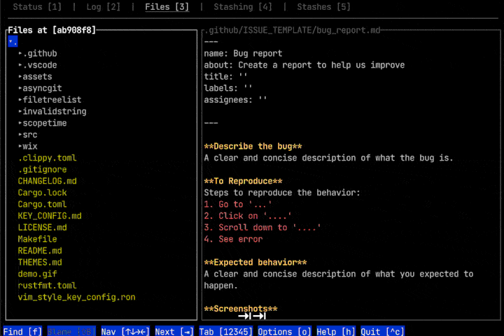

### Breaking Change
Have you used `key_config.ron` for custom key bindings before?
The way this works got changed and simplified ([See docs](https://github.com/extrawurst/gitui/blob/master/KEY_CONFIG.md) for more info):
* You only define the keys that should differ from the default.
* The file is renamed to `key_bindings.ron`
* Future addition of new keys will not break anymore

### Added
- add fetch/update command all remote branches ([#998](https://github.com/extrawurst/gitui/issues/998))
- add `trace-libgit` feature to make git tracing optional [[@dm9pZCAq](https://github.com/dm9pZCAq)] ([#902](https://github.com/extrawurst/gitui/issues/902))
- support merging and rebasing remote branches [[@R0nd](https://github.com/R0nd)] ([#920](https://github.com/extrawurst/gitui/issues/920))
- add highlighting matches in fuzzy finder [[@Mifom](https://github.com/Mifom)] ([#893](https://github.com/extrawurst/gitui/issues/893))
- support `home` and `end` keys in branchlist ([#957](https://github.com/extrawurst/gitui/issues/957))
- add `ghemoji` feature to make gh-emoji (GitHub emoji) optional [[@jirutka](https://github.com/jirutka)] ([#954](https://github.com/extrawurst/gitui/pull/954))
- allow customizing key symbols like `⏎` & `⇧` ([see docs](https://github.com/extrawurst/gitui/blob/master/KEY_CONFIG.md#key-symbols)) ([#465](https://github.com/extrawurst/gitui/issues/465))
- simplify key overrides ([see docs](https://github.com/extrawurst/gitui/blob/master/KEY_CONFIG.md)) ([#946](https://github.com/extrawurst/gitui/issues/946))
- dedicated fuzzy finder up/down keys to allow vim overrides ([#993](https://github.com/extrawurst/gitui/pull/993))
- pull will also download tags ([#1013](https://github.com/extrawurst/gitui/pull/1013))
- allow editing file from filetree ([#989](https://github.com/extrawurst/gitui/pull/989))
- support bare repos (new `workdir` argument) ([#1026](https://github.com/extrawurst/gitui/pull/1026))

### Fixed
- honor options (for untracked files) in `stage_all` command ([#933](https://github.com/extrawurst/gitui/issues/933))
- improved file diff speed dramatically ([#976](https://github.com/extrawurst/gitui/issues/976))
- blaming files in sub-folders on windows ([#981](https://github.com/extrawurst/gitui/issues/981))
- push failing due to tracing error in upstream ([#881](https://github.com/extrawurst/gitui/issues/881))

## [0.18] - 2021-10-11

**rebase merge with conflicts**

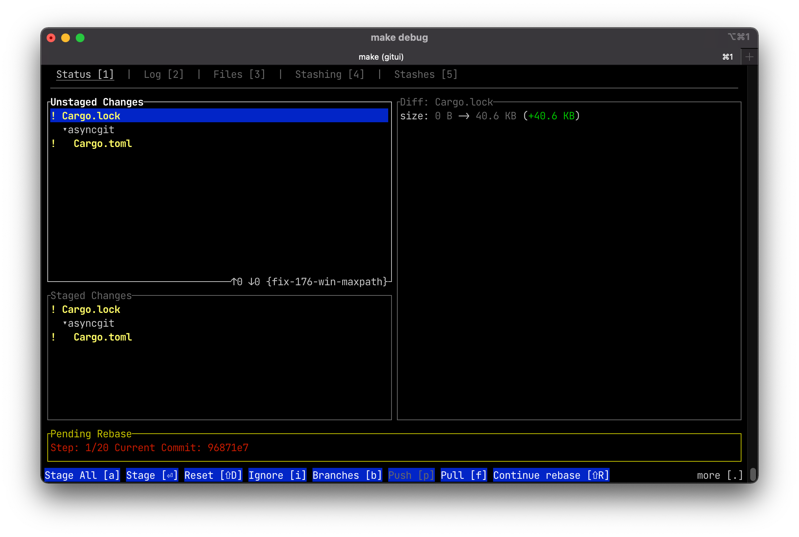

### Added
- support rebasing branches with conflicts ([#895](https://github.com/extrawurst/gitui/issues/895))
- add a key binding to stage / unstage items [[@alessandroasm](https://github.com/alessandroasm)] ([#909](https://github.com/extrawurst/gitui/issues/909))
- switch to status tab after merging or rebasing with conflicts ([#926](https://github.com/extrawurst/gitui/issues/926))

### Fixed
- fix supported checkout of hierarchical branchnames ([#921](https://github.com/extrawurst/gitui/issues/921))
- appropriate error message when pulling deleted remote branch ([#911](https://github.com/extrawurst/gitui/issues/911))
- improved color contrast in branches popup for light themes  [[@Cottser](https://github.com/Cottser)] ([#922](https://github.com/extrawurst/gitui/issues/922))
- use git_message_prettify for commit messages ([#917](https://github.com/extrawurst/gitui/issues/917))

## [0.17.1] - 2021-09-10

**fuzzy find files**

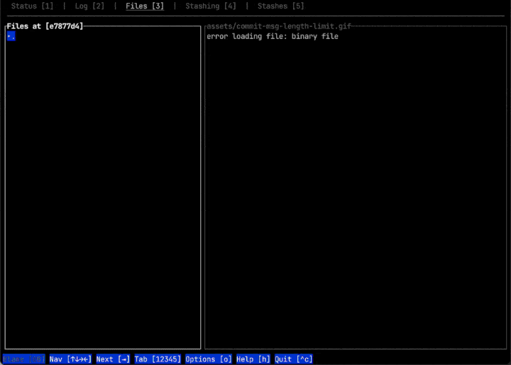

**emojified commit message**

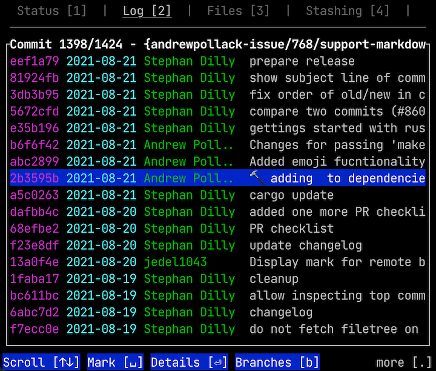

### Added
- add supporting rebasing on branch (if conflict-free) ([#816](https://github.com/extrawurst/gitui/issues/816))
- fuzzy find files ([#891](https://github.com/extrawurst/gitui/issues/891))
- visualize progress during async syntax highlighting ([#889](https://github.com/extrawurst/gitui/issues/889))
- added support for markdown emoji's in commits [[@andrewpollack](https://github.com/andrewpollack)] ([#768](https://github.com/extrawurst/gitui/issues/768))
- added scrollbar to revlog [[@ashvin021](https://github.com/ashvin021)] ([#868](https://github.com/extrawurst/gitui/issues/868))

### Fixed
- fix build when system level libgit2 version was used ([#883](https://github.com/extrawurst/gitui/issues/883))
- fix merging branch not closing branch window [[@andrewpollack](https://github.com/andrewpollack)] ([#876](https://github.com/extrawurst/gitui/issues/876))
- fix commit msg being broken inside tag list ([#871](https://github.com/extrawurst/gitui/issues/871))
- fix filetree file content not showing tabs correctly ([#874](https://github.com/extrawurst/gitui/issues/874))

### Key binding notes
- new keys: `rebase_branch` [`R`], `file_find` [`f`]

see `vim_style_key_config.ron` for their default vim binding

## [0.17.0] - 2021-08-21

**compare commits**

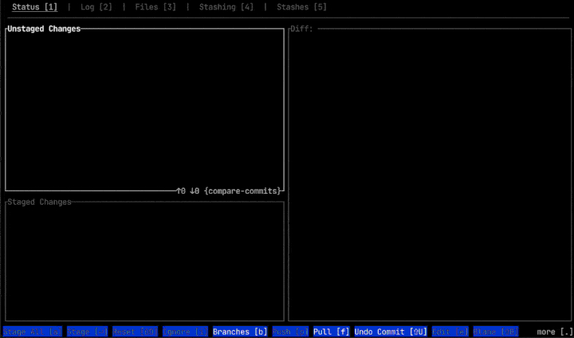

**options**

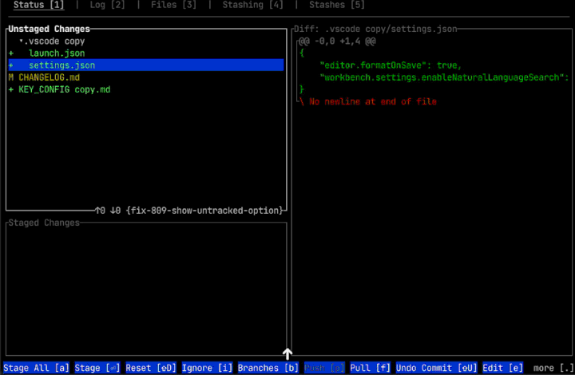

**drop multiple stashes**

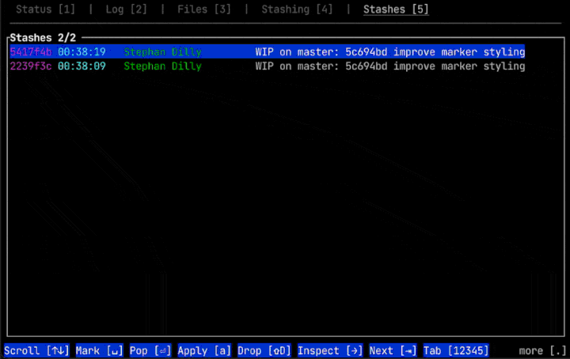

**branch name validation**

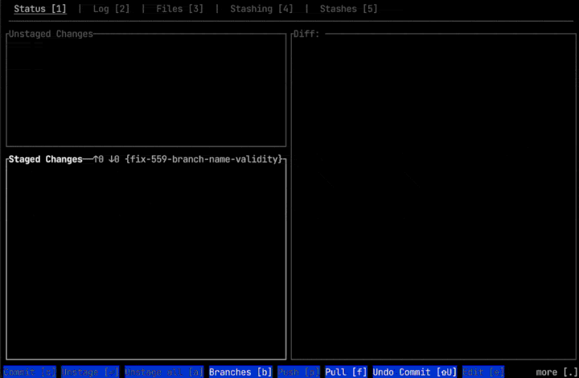

### Added
- allow inspecting top commit of a branch from list
- compare commits in revlog and head against branch ([#852](https://github.com/extrawurst/gitui/issues/852))
- new options popup (show untracked files, diff settings) ([#849](https://github.com/extrawurst/gitui/issues/849))
- mark and drop multiple stashes ([#854](https://github.com/extrawurst/gitui/issues/854))
- check branch name validity while typing ([#559](https://github.com/extrawurst/gitui/issues/559))
- support deleting remote branch [[@zcorniere](https://github.com/zcorniere)] ([#622](https://github.com/extrawurst/gitui/issues/622))
- mark remote branches that have local tracking branch [[@jedel1043](https://github.com/jedel1043)] ([#861](https://github.com/extrawurst/gitui/issues/861))

### Fixed
- error viewing filetree in empty repo ([#859](https://github.com/extrawurst/gitui/issues/859))
- do not allow to ignore .gitignore files ([#825](https://github.com/extrawurst/gitui/issues/825))
- crash in shallow repo ([#836](https://github.com/extrawurst/gitui/issues/836))
- fixed performance regression in revlog ([#850](https://github.com/extrawurst/gitui/issues/850))
- fixed performance degradation when quitting on Windows ([#823](https://github.com/extrawurst/gitui/issues/823))

## [0.16.2] - 2021-07-10

**undo last commit**

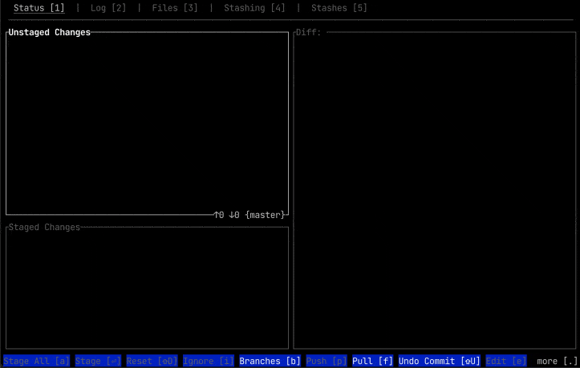

**mark local tags**

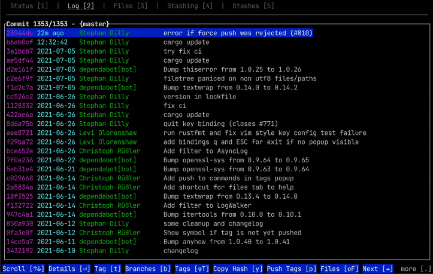

### Added
- taglist: show arrow-symbol on tags not present on origin [[@cruessler](https://github.com/cruessler)] ([#776](https://github.com/extrawurst/gitui/issues/776))
- new `undo-last-commit` command [[@remique](https://github.com/remique)] ([#758](https://github.com/extrawurst/gitui/issues/758))
- new quit key `[q]` ([#771](https://github.com/extrawurst/gitui/issues/771))
- proper error message if remote rejects force push ([#801](https://github.com/extrawurst/gitui/issues/801))

### Fixed
- openssl vendoring broken on macos ([#772](https://github.com/extrawurst/gitui/issues/772))
- amend and other commands not shown in help ([#778](https://github.com/extrawurst/gitui/issues/778))
- focus locked on commit msg details in narrow term sizes ([#780](https://github.com/extrawurst/gitui/issues/780))
- non-utf8 file/path names broke filetree ([#802](https://github.com/extrawurst/gitui/issues/802))

## [0.16.1] - 2021-06-06

### Added
- honor `config.showUntrackedFiles` improving speed with a lot of untracked items ([#752](https://github.com/extrawurst/gitui/issues/752))
- improve performance when opening filetree-tab ([#756](https://github.com/extrawurst/gitui/issues/756))
- indicator for longer commit message than displayed ([#773](https://github.com/extrawurst/gitui/issues/773))

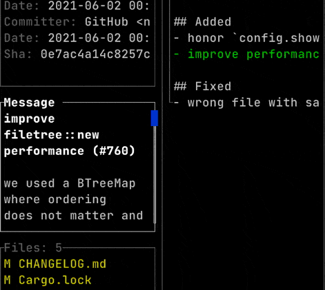

### Fixed
- wrong file with same name shown in file tree ([#748](https://github.com/extrawurst/gitui/issues/748))
- filetree collapsing broken on windows ([#761](https://github.com/extrawurst/gitui/issues/761))
- unnecessary overdraw of the spinner on each redraw ([#764](https://github.com/extrawurst/gitui/issues/764))

### Internal
- use git_repository_message [[@kosayoda](https://github.com/kosayoda)] ([#751](https://github.com/extrawurst/gitui/issues/751))

## [0.16.0] - 2021-05-28

**merge branch, merge commit**

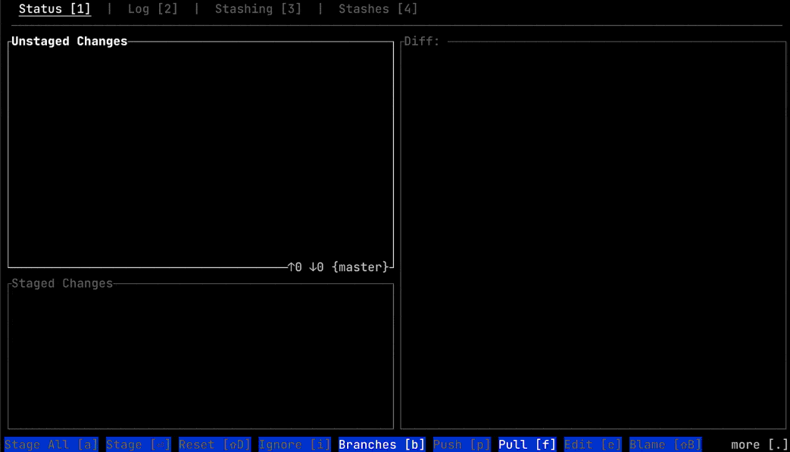

**tag list popup**

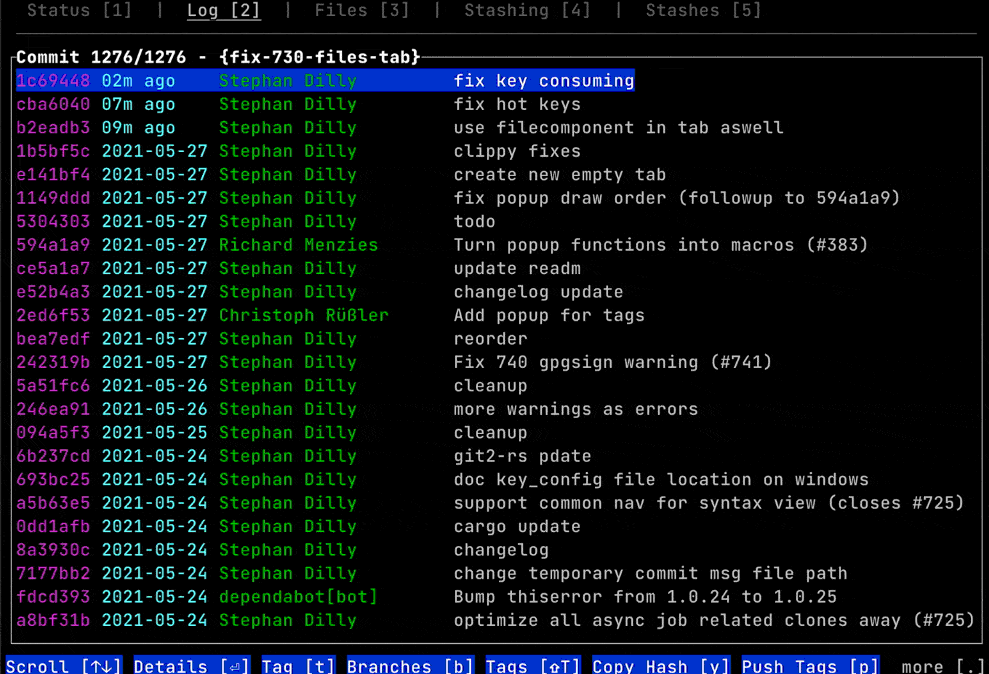

**revision file tree**

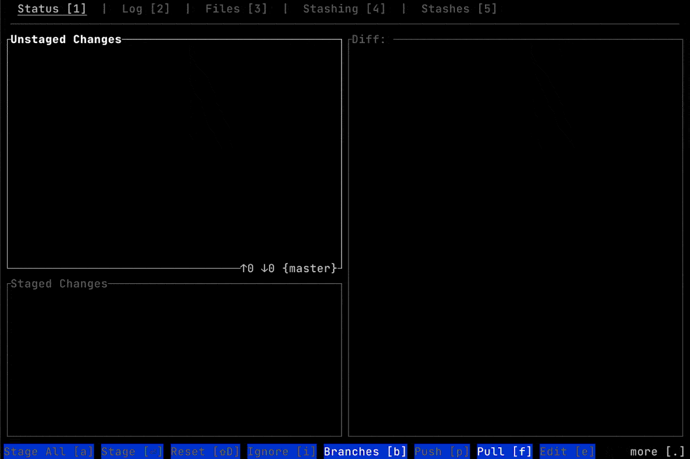

**commit subject length warning**

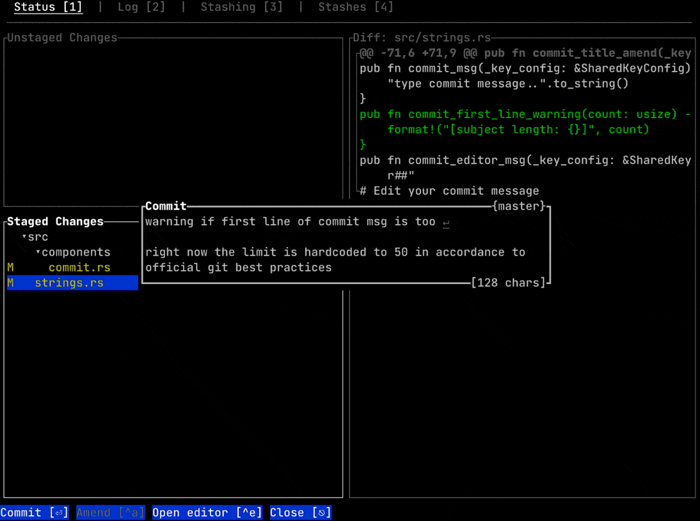

### Added
- merging branches, pull-merge with conflicts, commit merges ([#485](https://github.com/extrawurst/gitui/issues/485))
- tags-list-popup (delete-tag, go to tagged commit) [[@cruessler](https://github.com/cruessler)] ([#483](https://github.com/extrawurst/gitui/issues/483))
- inspect file tree tab ([#743](https://github.com/extrawurst/gitui/issues/743))
- file tree popup (for a specific revision) ([#714](https://github.com/extrawurst/gitui/issues/714))
- warning if commit subject line gets too long ([#478](https://github.com/extrawurst/gitui/issues/478))
- `--bugreport` cmd line arg to help diagnostics [[@zcorniere](https://github.com/zcorniere)] ([#695](https://github.com/extrawurst/gitui/issues/695))

### Changed
- smarter log timestamps ([#682](https://github.com/extrawurst/gitui/issues/682))
- create-branch popup aligned with rename-branch [[@bruceCoelho](https://github.com/bruceCoelho)] ([#679](https://github.com/extrawurst/gitui/issues/679))
- smart focus change after staging all files ([#706](https://github.com/extrawurst/gitui/issues/706))
- do not allow to commit when `gpgsign` enabled ([#740](https://github.com/extrawurst/gitui/issues/740))

### Fixed
- selected-tab color broken in light theme [[@Cottser](https://github.com/Cottser)] ([#719](https://github.com/extrawurst/gitui/issues/719))
- proper tmp file location to externally edit commit msg ([#518](https://github.com/extrawurst/gitui/issues/518))

## [0.15.0] - 2021-04-27

**file blame**

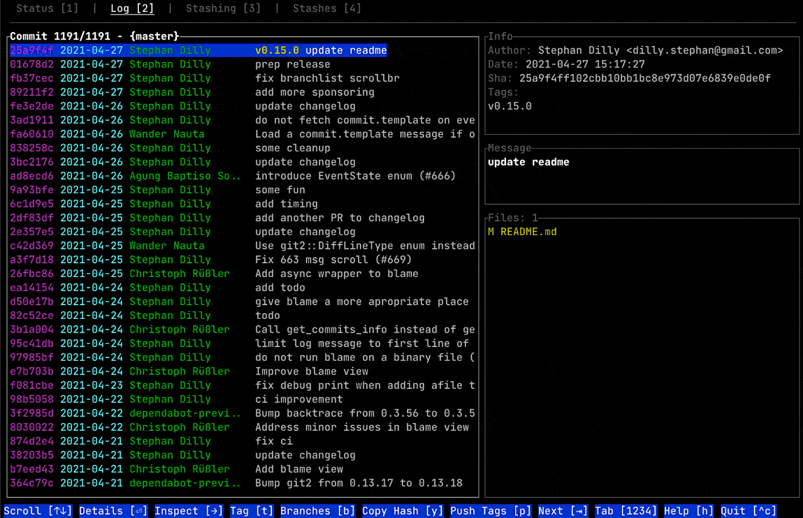

### Added
- blame a file [[@cruessler](https://github.com/cruessler)] ([#484](https://github.com/extrawurst/gitui/issues/484))
- support commit.template [[@wandernauta](https://github.com/wandernauta)] ([#546](https://github.com/extrawurst/gitui/issues/546))

### Fixed
- debug print when adding a file to ignore
- fix scrolling long messages in commit details view ([#663](https://github.com/extrawurst/gitui/issues/663))
- limit log messages in log tab ([#652](https://github.com/extrawurst/gitui/issues/652))
- fetch crashed when no upstream of branch is set ([#637](https://github.com/extrawurst/gitui/issues/637))
- `enter` key panics in empty remote branch list ([#643](https://github.com/extrawurst/gitui/issues/643))

### Internal
- cleanup some stringly typed code [[@wandernauta](https://github.com/wandernauta)] ([#655](https://github.com/extrawurst/gitui/issues/655))
- introduce EventState enum (removing bool for even propagation) [[@tisorlawan](https://github.com/tisorlawan)] ([#665](https://github.com/extrawurst/gitui/issues/665))

## [0.14.0] - 2021-04-11

### Added
- `[w]` key to toggle between staging/workdir [[@terhechte](https://github.com/terhechte)] ([#595](https://github.com/extrawurst/gitui/issues/595))
- view/checkout remote branches ([#617](https://github.com/extrawurst/gitui/issues/617))

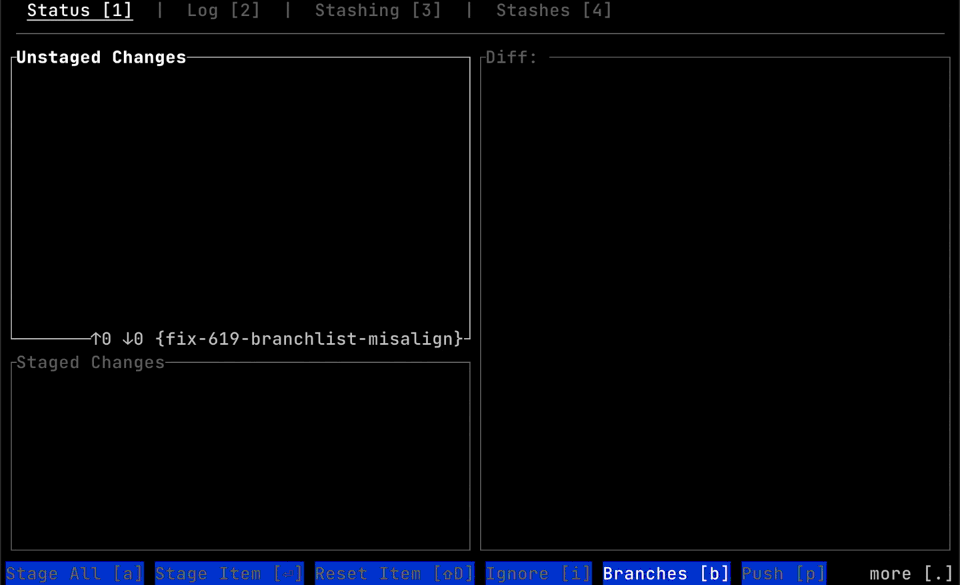

### Changed
- ask to pop stash by default (*apply* using `[a]` now) [[@brunogouveia](https://github.com/brunogouveia)] ([#574](https://github.com/extrawurst/gitui/issues/574))

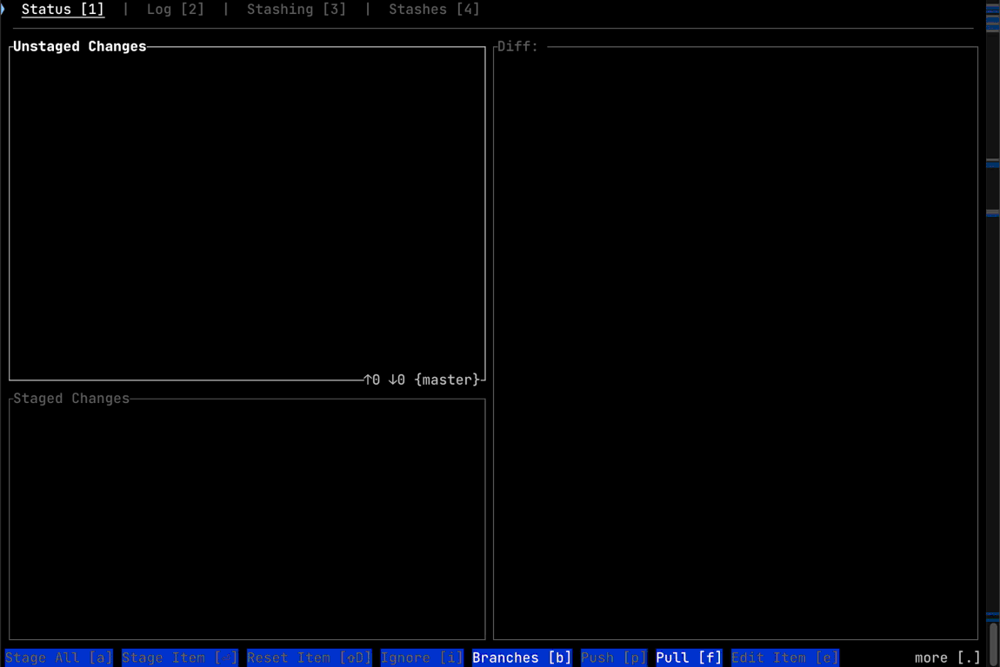

### Fixed
- push branch to its tracking remote ([#597](https://github.com/extrawurst/gitui/issues/597))
- fixed panic when staging lines involving missing newline eof ([#605](https://github.com/extrawurst/gitui/issues/605))
- fixed pull/fetch deadlocking when it fails ([#624](https://github.com/extrawurst/gitui/issues/624))

## [0.13.0] - 2021-03-15 - Happy Birthday GitUI 🥳

Thanks for your interest and support over this year! Read more about the 1 year anniversary reflections of this project on my [blog](https://blog.extrawurst.org/general/programming/rust/2021/03/15/gitui-a-year-in-opensource.html).

**stage/unstage/discard by line**

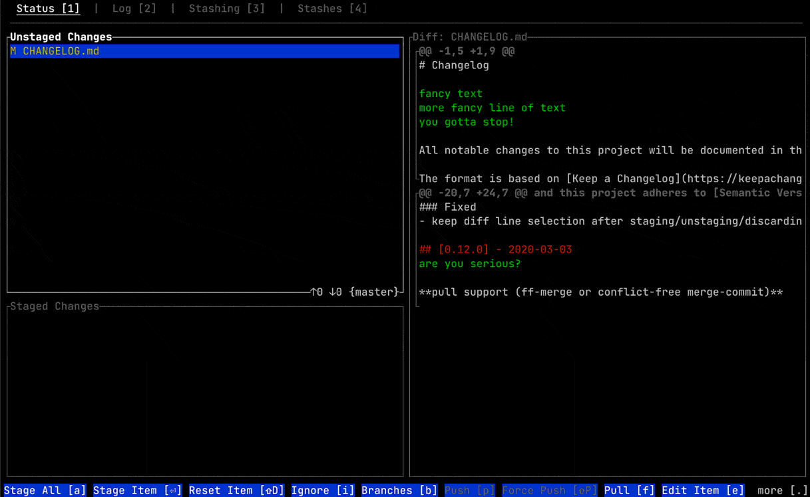

**push tags**

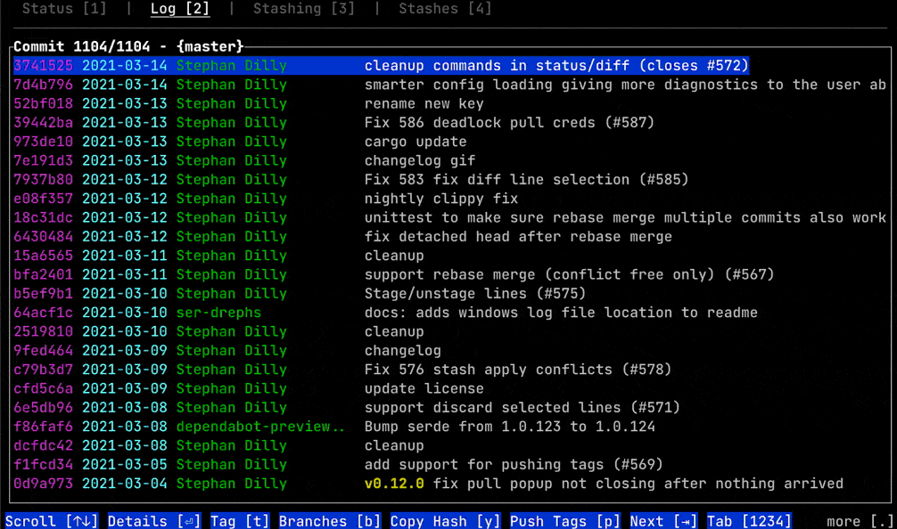

### Changed
- `[s]` key repurposed to trigger line based (un)stage
- cleanup status/diff commands to be more context sensitive ([#572](https://github.com/extrawurst/gitui/issues/572))

### Added
- support pull via rebase (using config `pull.rebase`) ([#566](https://github.com/extrawurst/gitui/issues/566))
- support stage/unstage selected lines ([#59](https://github.com/extrawurst/gitui/issues/59))
- support discarding selected lines ([#59](https://github.com/extrawurst/gitui/issues/59))
- support for pushing tags ([#568](https://github.com/extrawurst/gitui/issues/568))
- visualize *conflicted* files differently ([#576](https://github.com/extrawurst/gitui/issues/576))

### Fixed
- keep diff line selection after staging/unstaging/discarding ([#583](https://github.com/extrawurst/gitui/issues/583))
- fix pull deadlocking when aborting credentials input ([#586](https://github.com/extrawurst/gitui/issues/586))
- error diagnostics for config loading ([#589](https://github.com/extrawurst/gitui/issues/589))

## [0.12.0] - 2021-03-03

**pull support (ff-merge or conflict-free merge-commit)**

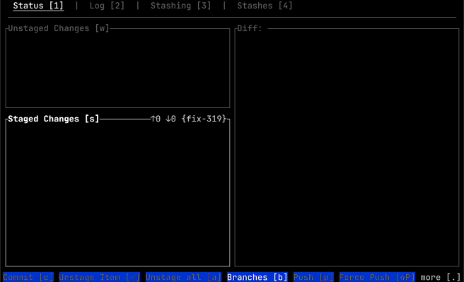

**more info in commit popup**

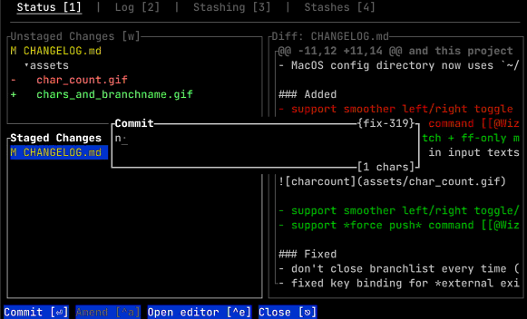

### Breaking Change
- MacOS config directory now uses `~/.config/gitui` [[@remique](https://github.com/remique)] ([#317](https://github.com/extrawurst/gitui/issues/317))

### Added
- support for pull (fetch + simple merging) ([#319](https://github.com/extrawurst/gitui/issues/319))
- show used char count in input texts ([#466](https://github.com/extrawurst/gitui/issues/466))
- support smoother left/right toggle/keys for commit details ([#418](https://github.com/extrawurst/gitui/issues/418))
- support *force push* command [[@WizardOhio24](https://github.com/WizardOhio24)] ([#274](https://github.com/extrawurst/gitui/issues/274))

### Fixed
- don't close branchlist every time ([#550](https://github.com/extrawurst/gitui/issues/550))
- fixed key binding for *external exitor* in vim key bindings [[@yanganto](https://github.com/yanganto)] ([#549](https://github.com/extrawurst/gitui/issues/549))
- fix some potential errors when deleting files while they are being diffed ([#490](https://github.com/extrawurst/gitui/issues/490))
- push defaults to 'origin' remote if it exists ([#494](https://github.com/extrawurst/gitui/issues/494))
- support missing pageUp/down support in branchlist ([#519](https://github.com/extrawurst/gitui/issues/519))
- don't hide branch name while in commit dialog ([#529](https://github.com/extrawurst/gitui/issues/529))
- don't discard commit message without confirmation ([#530](https://github.com/extrawurst/gitui/issues/530))
- compilation broken on freebsd ([#461](https://github.com/extrawurst/gitui/issues/461))
- don’t fail if `user.name` is not set [[@cruessler](https://github.com/cruessler)] ([#79](https://github.com/extrawurst/gitui/issues/79)) ([#228](https://github.com/extrawurst/gitui/issues/228))

## [0.11.0] - 2021-12-20

### Added
- push to remote ([#265](https://github.com/extrawurst/gitui/issues/265)) ([#267](https://github.com/extrawurst/gitui/issues/267))

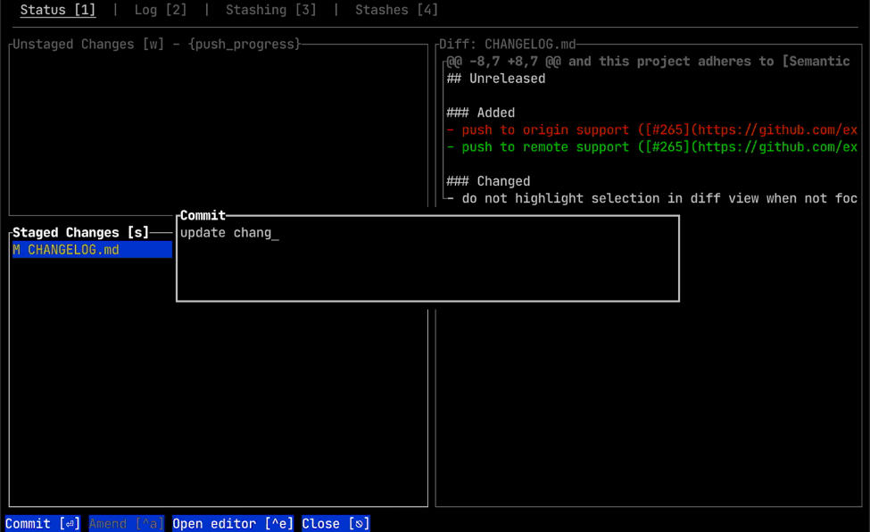

- number of incoming/outgoing commits to upstream ([#362](https://github.com/extrawurst/gitui/issues/362))
- new branch list popup incl. checkout/delete/rename [[@WizardOhio24](https://github.com/WizardOhio24)] ([#303](https://github.com/extrawurst/gitui/issues/303)) ([#323](https://github.com/extrawurst/gitui/issues/323))

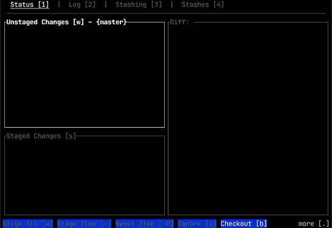

- compact treeview [[@WizardOhio24](https://github.com/WizardOhio24)] ([#192](https://github.com/extrawurst/gitui/issues/192))

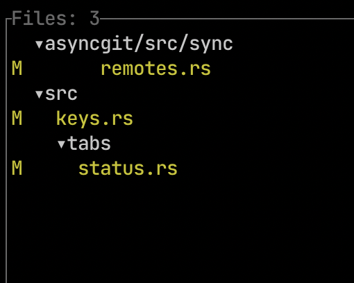

- scrollbar in long commit messages [[@timaliberdov](https://github.com/timaliberdov)] ([#308](https://github.com/extrawurst/gitui/issues/308))
- added windows scoop recipe ([#164](https://github.com/extrawurst/gitui/issues/164))
- added gitui to [chocolatey](https://chocolatey.org/packages/gitui) on windows by [@nils-a](https://github.com/nils-a)
- added gitui gentoo instructions to readme [[@dm9pZCAq](https://github.com/dm9pZCAq)] ([#430](https://github.com/extrawurst/gitui/pull/430))
- added windows installer (msi) to release [[@pm100](https://github.com/pm100)] ([#360](https://github.com/extrawurst/gitui/issues/360))
- command to copy commit hash [[@yanganto](https://github.com/yanganto)] ([#281](https://github.com/extrawurst/gitui/issues/281))

### Changed
- upgrade `dirs` to `dirs-next` / remove cfg migration code ([#351](https://github.com/extrawurst/gitui/issues/351)) ([#366](https://github.com/extrawurst/gitui/issues/366))
- do not highlight selection in diff view when not focused ([#270](https://github.com/extrawurst/gitui/issues/270))
- copy to clipboard using `xclip`(linux), `pbcopy`(mac) or `clip`(win) [[@cruessler](https://github.com/cruessler)] ([#262](https://github.com/extrawurst/gitui/issues/262))

### Fixed
- crash when changing git repo while gitui is open ([#271](https://github.com/extrawurst/gitui/issues/271))
- remove workaround for color serialization [[@1wilkens](https://github.com/1wilkens)] ([#149](https://github.com/extrawurst/gitui/issues/149))
- crash on small terminal size ([#307](https://github.com/extrawurst/gitui/issues/307))
- fix vim keybindings uppercase handling [[@yanganto](https://github.com/yanganto)] ([#286](https://github.com/extrawurst/gitui/issues/286))
- remove shift tab windows workaround [[@nils-a](https://github.com/nils-a)] ([#112](https://github.com/extrawurst/gitui/issues/112))
- core.editor is ignored [[@pm100](https://github.com/pm100)] ([#414](https://github.com/extrawurst/gitui/issues/414))

## [0.10.1] - 2020-09-01

### Fixed
- static linux binaries broke due to new clipboard feature which is disabled on linux for now ([#259](https://github.com/extrawurst/gitui/issues/259))

## [0.10.0] - 2020-08-29

### Added

- fully **customizable key bindings** (see [KEY_CONFIG.md](KEY_CONFIG.md)) [[@yanganto](https://github.com/yanganto)] ([#109](https://github.com/extrawurst/gitui/issues/109)) ([#57](https://github.com/extrawurst/gitui/issues/57))
- support scrolling in long commit messages [[@cruessler](https://github.com/cruessler)]([#208](https://github.com/extrawurst/gitui/issues/208))

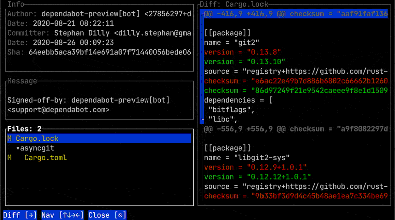

- copy lines from diffs to clipboard [[@cruessler](https://github.com/cruessler)]([#229](https://github.com/extrawurst/gitui/issues/229))

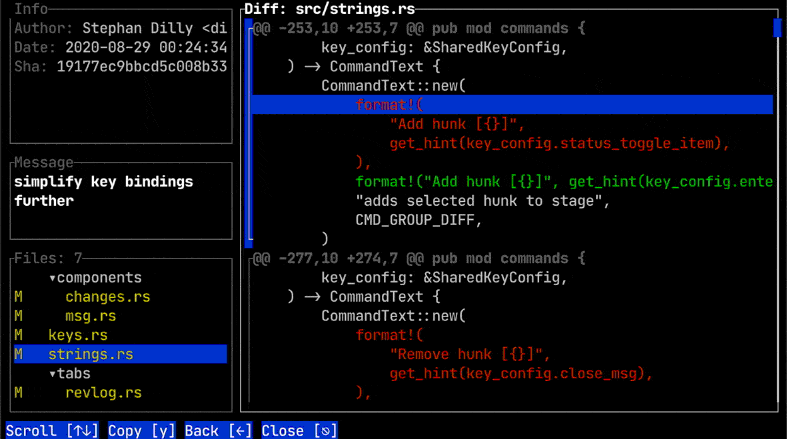

- scrollbar in long diffs ([#204](https://github.com/extrawurst/gitui/issues/204))

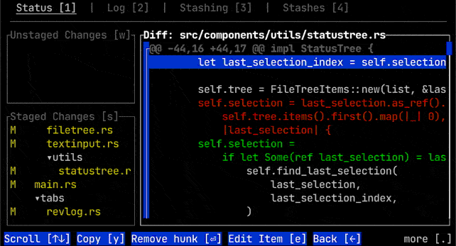

- allow creating new branch ([#253](https://github.com/extrawurst/gitui/issues/253))

### Fixed

- selection error in stashlist when deleting last element ([#223](https://github.com/extrawurst/gitui/issues/223))
- git hooks broke ci build on windows [[@dr-BEat](https://github.com/dr-BEat)] ([#235](https://github.com/extrawurst/gitui/issues/235))

## [0.9.1] - 2020-07-30

### Added

- move to (un)staged when the current selection is empty [[@jonstodle](https://github.com/jonstodle)]([#215](https://github.com/extrawurst/gitui/issues/215))
- pending load of a diff/status is visualized ([#160](https://github.com/extrawurst/gitui/issues/160))
- entry on [git-scm.com](https://git-scm.com/downloads/guis) in the list of GUI tools [[@Vidar314](https://github.com/Vidar314)] (see [PR](https://github.com/git/git-scm.com/pull/1485))
- commits can be tagged in revlog [[@cruessler](https://github.com/cruessler)]([#103](https://github.com/extrawurst/gitui/issues/103))

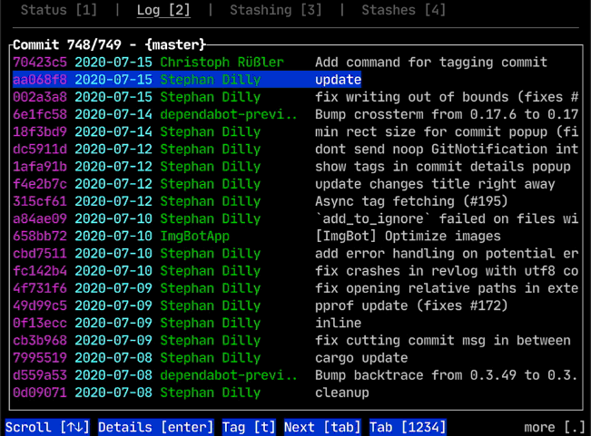

### Changed

- async fetching tags to improve reactivity in giant repos ([#170](https://github.com/extrawurst/gitui/issues/170))

### Fixed

- removed unmaintained dependency `spin` ([#172](https://github.com/extrawurst/gitui/issues/172))
- opening relative paths in external editor may fail in subpaths ([#184](https://github.com/extrawurst/gitui/issues/184))
- crashes in revlog with utf8 commit messages ([#188](https://github.com/extrawurst/gitui/issues/188))
- `add_to_ignore` failed on files without a newline at EOF ([#191](https://github.com/extrawurst/gitui/issues/191))
- new tags were not picked up in revlog view ([#190](https://github.com/extrawurst/gitui/issues/190))
- tags not shown in commit details popup ([#193](https://github.com/extrawurst/gitui/issues/193))
- min size for relative popups on small terminals ([#179](https://github.com/extrawurst/gitui/issues/179))
- fix crash on resizing terminal to very small width ([#198](https://github.com/extrawurst/gitui/issues/198))
- fix broken tags when using a different internal representation ([#206](https://github.com/extrawurst/gitui/issues/206))
- tags are not cleanly separated in details view ([#212](https://github.com/extrawurst/gitui/issues/212))

## [0.8.1] - 2020-07-07

### Added

- open file in editor [[@jonstodle](https://github.com/jonstodle)]([#166](https://github.com/extrawurst/gitui/issues/166))

### Fixed

- switch deprecated transitive dependency `net2`->`socket2` [in `crossterm`->`mio`]([#66](https://github.com/extrawurst/gitui/issues/66))
- crash diffing a stash that was created via cli ([#178](https://github.com/extrawurst/gitui/issues/178))
- zero delta file size in diff of untracked binary file ([#171](https://github.com/extrawurst/gitui/issues/171))
- newlines not visualized correctly in commit editor ([#169](https://github.com/extrawurst/gitui/issues/169))

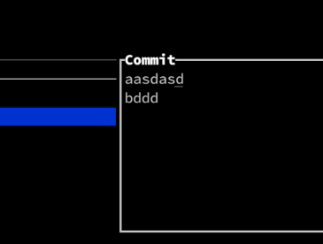

## [0.8.0] - 2020-07-06

### Added

- core homebrew [formulae](https://formulae.brew.sh/formula/gitui#default): `brew install gitui` [[@vladimyr](https://github.com/vladimyr)](<[#137](https://github.com/extrawurst/gitui/issues/137)>)
- show file sizes and delta on binary diffs ([#141](https://github.com/extrawurst/gitui/issues/141))

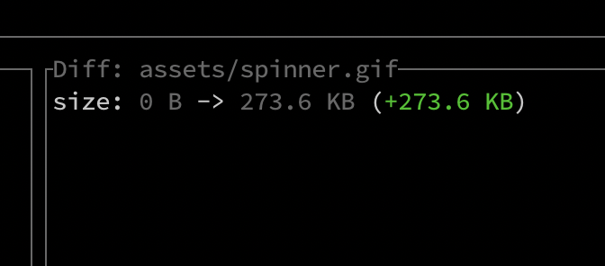

- external editor support for commit messages [[@jonstodle](https://github.com/jonstodle)]([#46](https://github.com/extrawurst/gitui/issues/46))

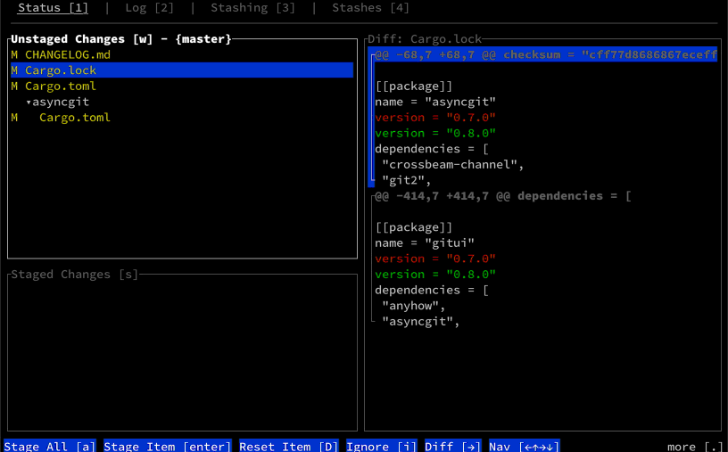

### Changed

- use terminal blue as default selection background ([#129](https://github.com/extrawurst/gitui/issues/129))
- author column in revlog is now fixed width for better alignment ([#148](https://github.com/extrawurst/gitui/issues/148))
- cleaner tab bar and background work indicating spinner:

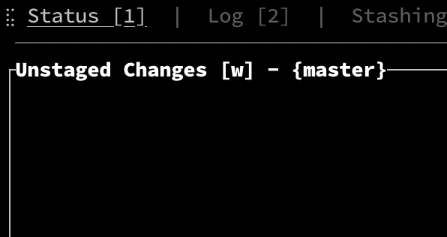

### Fixed

- clearer help headers ([#131](https://github.com/extrawurst/gitui/issues/131))
- display non-utf8 commit messages at least partially ([#150](https://github.com/extrawurst/gitui/issues/150))
- hooks ignored when running `gitui` in subfolder of workdir ([#151](https://github.com/extrawurst/gitui/issues/151))
- better scrolling in file-trees [[@tisorlawan](https://github.com/tisorlawan)]([#144](https://github.com/extrawurst/gitui/issues/144))
- show untracked files in stash commit details [[@MCord](https://github.com/MCord)]([#130](https://github.com/extrawurst/gitui/issues/130))
- in some repos looking up the branch name was a bottleneck ([#159](https://github.com/extrawurst/gitui/issues/159))
- some optimizations in reflog
- fix arrow utf8 encoding in help window [[@daober](https://github.com/daober)]([#142](https://github.com/extrawurst/gitui/issues/142))

## [0.7.0] - 2020-06-15

### Added

- Inspect stash commit in detail ([#121](https://github.com/extrawurst/gitui/issues/121))
- Support reset/revert individual hunks ([#11](https://github.com/extrawurst/gitui/issues/11))
- Commit Amend (`ctrl+a`) when in commit popup ([#89](https://github.com/extrawurst/gitui/issues/89))

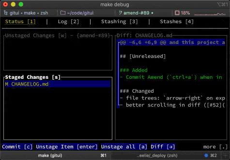

### Changed

- file trees: `arrow-right` on expanded folder moves down into folder
- better scrolling in diff ([#52](https://github.com/extrawurst/gitui/issues/52))
- display current branch in status/log ([#115](https://github.com/extrawurst/gitui/issues/115))
- commit msg popup: add cursor and more controls (`arrow-left/right`, `delete` & `backspace`) [[@alistaircarscadden](https://github.com/alistaircarscadden)]([#46](https://github.com/extrawurst/gitui/issues/46))
- moved `theme.ron` from `XDG_CACHE_HOME` to `XDG_CONFIG_HOME` [[@jonstodle](https://github.com/jonstodle)](<[#98](https://github.com/extrawurst/gitui/issues/98)>)

### Fixed

- reset file inside folder failed when running `gitui` in a subfolder too ([#118](https://github.com/extrawurst/gitui/issues/118))
- selection could disappear into collapsed folder ([#120](https://github.com/extrawurst/gitui/issues/120))
- `Files: loading` sometimes wrong ([#119](https://github.com/extrawurst/gitui/issues/119))

## [0.6.0] - 2020-06-09

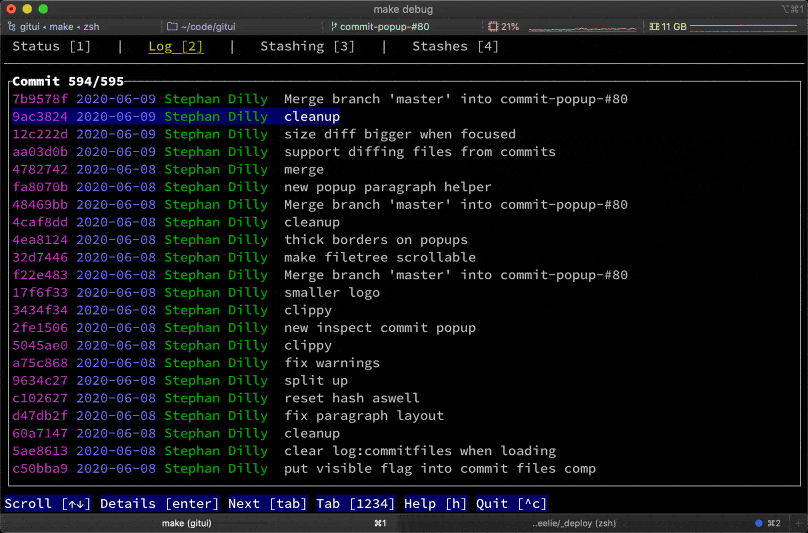

### Changed

- changed hotkeys for selecting stage/workdir (**Note:** use `[w]`/`[s]` to change between workdir and stage) and added hotkeys (`[1234]`) to switch to tabs directly ([#92](https://github.com/extrawurst/gitui/issues/92))
- `arrow-up`/`down` on bottom/top of status file list switches focus ([#105](https://github.com/extrawurst/gitui/issues/105))
- highlight tags in revlog better

### Added

- New `Stage all [a]`/`Unstage all [a]` in changes lists ([#82](https://github.com/extrawurst/gitui/issues/82))
- add `-d`, `--directory` options to set working directory via program arg [[@alistaircarscadden](https://github.com/alistaircarscadden)]([#73](https://github.com/extrawurst/gitui/issues/73))
- commit detail view in revlog ([#80](https://github.com/extrawurst/gitui/issues/80))

### Fixed

- app closes when staging invalid file/path ([#108](https://github.com/extrawurst/gitui/issues/108))
- `shift+tab` not working on windows [[@MCord](https://github.com/MCord)]([#111](https://github.com/extrawurst/gitui/issues/111))

## [0.5.0] - 2020-06-01

### Changed

- support more commands allowing optional multiline commandbar ([#83](https://github.com/extrawurst/gitui/issues/83))

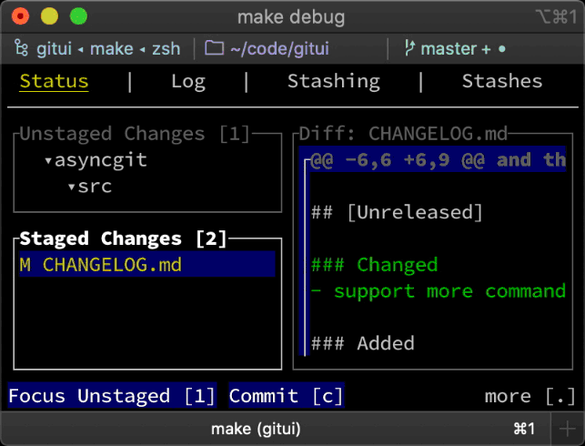

### Added

- support adding untracked file/folder to `.gitignore` ([#44](https://github.com/extrawurst/gitui/issues/44))
- support reverse tabbing using shift+tab ([#92](https://github.com/extrawurst/gitui/issues/92))
- switch to using cmd line args instead of `ENV` (`-l` for logging and `--version`) **please convert your GITUI_LOGGING usage** [[@shenek](https://github.com/shenek)]([#88](https://github.com/extrawurst/gitui/issues/88))
- added missing LICENSE.md files in sub-crates [[@ignatenkobrain](https://github.com/ignatenkobrain)]([#94](https://github.com/extrawurst/gitui/pull/94))

### Fixed

- error when diffing huge files ([#96](https://github.com/extrawurst/gitui/issues/96))
- expressive error when run in bare repos ([#100](https://github.com/extrawurst/gitui/issues/100))

## [0.4.0] - 2020-05-25

### Added

- stashing support (save,apply,drop) ([#3](https://github.com/extrawurst/gitui/issues/3))

### Changed

- log tab refreshes when head changes ([#78](https://github.com/extrawurst/gitui/issues/78))
- performance optimization of the log tab in big repos
- more readable default color for the commit hash in the log tab
- more error/panic resiliance (`unwrap`/`panic` denied by clippy now) [[@MCord](https://github.com/MCord)](<[#77](https://github.com/extrawurst/gitui/issues/77)>)

### Fixes

- panic on small terminal width ([#72](https://github.com/extrawurst/gitui/issues/72))

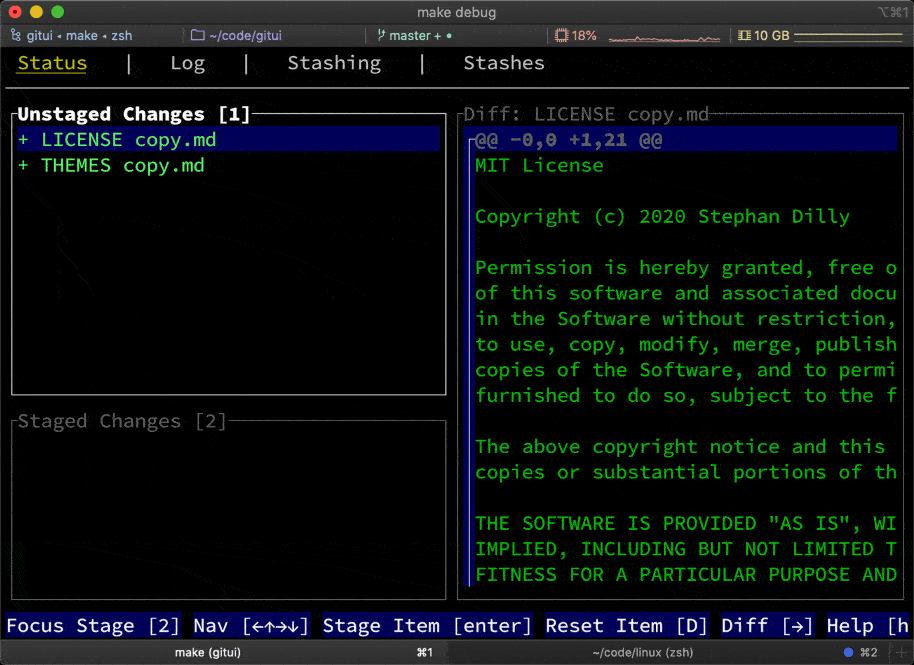

## [0.3.0] - 2020-05-20

### Added

- support color themes and light mode [[@MCord](https://github.com/MCord)]([#28](https://github.com/extrawurst/gitui/issues/28))

### Changed

- more natural scrolling in log tab ([#52](https://github.com/extrawurst/gitui/issues/52))

### Fixed

- crash on commit when git name was not set ([#74](https://github.com/extrawurst/gitui/issues/74))
- log tab shown empty in single commit repos ([#75](https://github.com/extrawurst/gitui/issues/75))

## [0.2.6] - 2020-05-18

### Fixed

- fix crash help in small window size ([#63](https://github.com/extrawurst/gitui/issues/63))

## [0.2.5] - 2020-05-16

### Added

- introduced proper changelog
- hook support on windows [[@MCord](https://github.com/MCord)]([#14](https://github.com/extrawurst/gitui/issues/14))

### Changed

- show longer commit messages in log view
- introduce proper error handling in `asyncgit` [[@MCord](https://github.com/MCord)]([#53](https://github.com/extrawurst/gitui/issues/53))
- better error message when trying to run outside of a valid git repo ([#56](https://github.com/extrawurst/gitui/issues/56))
- improve ctrl+c handling so it is checked first and no component needs to worry of blocking it

### Fixed

- support multiple tags per commit in log ([#61](https://github.com/extrawurst/gitui/issues/61))

## [0.2.3] - 2020-05-12

### Added

- support more navigation keys: home/end/pageUp/pageDown ([#43](https://github.com/extrawurst/gitui/issues/43))
- highlight current tab a bit better

## [0.2.2] - 2020-05-10

### Added

- show tags in commit log ([#47](https://github.com/extrawurst/gitui/issues/47))
- support home/end key in diff ([#43](https://github.com/extrawurst/gitui/issues/43))

### Changed

- close application shortcut is now the standard `ctrl+c`
- some diff improvements ([#42](https://github.com/extrawurst/gitui/issues/42))

### Fixed

- document tab key to switch tabs ([#48](https://github.com/extrawurst/gitui/issues/48))
