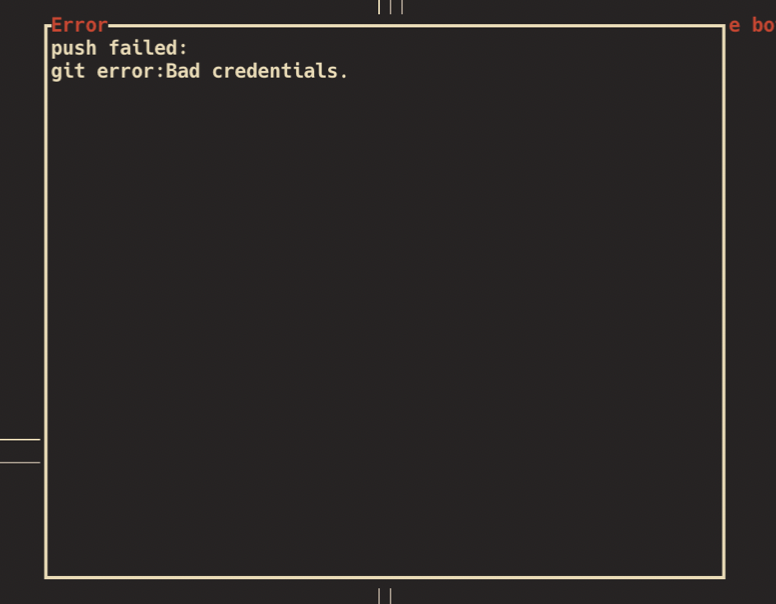

##  Table of Contents

1. ["Bad Credentials" Error](#credentials)
2. [Custom key bindings](#keybindings)
2. [Watcher](#watcher)

## 1.  "Bad Credentials" Error <small>[Top ▲](#table-of-contents)</small>

Some users have trouble pushing/pulling from remotes and adding their ssh-key to their ssh-agent solved the issue. The error they get is:

See Github's excellent documentation for [Adding your SSH Key to the ssh-agent](https://docs.github.com/en/authentication/connecting-to-github-with-ssh/generating-a-new-ssh-key-and-adding-it-to-the-ssh-agent#adding-your-ssh-key-to-the-ssh-agent)

Note that in some cases adding the line `ssh-add -K ~/.ssh/id_ed25519`(or whatever your key is called) to your bash init script is necessary too to survive restarts.

## 2.  Custom key bindings <small>[Top ▲](#table-of-contents)</small>

If you want to use `vi`-style keys or customize your key bindings in any other fashion see the specific docs on that: [key config](./KEY_CONFIG.md)

## 3.  Watching for changes <small>[Top ▲](#table-of-contents)</small>

By default, `gitui` polls for changes in the working directory every 5 seconds. If you supply `--watcher` as an argument, it uses a `notify`-based approach instead. This is usually faster and was for some time the default update strategy. It turned out, however, that `notify`-based updates can cause issues on some platforms, so tick-based updates seemed like a safer default.

See #1444 for details.
