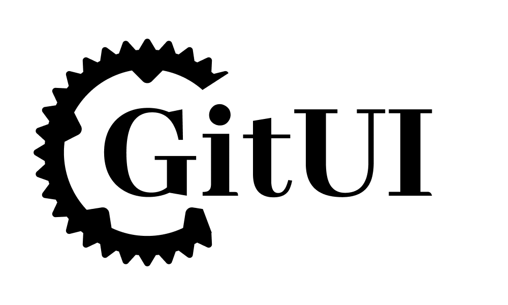
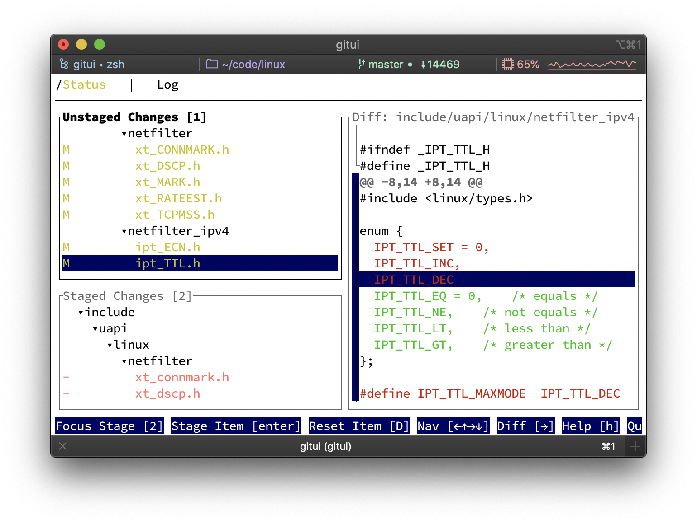

<h1 align="center">


[![CI][s0]][l0] [![crates][s1]][l1] ![MIT][s2] [![UNSAFE][s3]][l3] [![ITCH][s4]][l4] [![DISC][s5]][l5] [![TWEET][s6]][l6]

</h1>

[s0]: https://github.com/extrawurst/gitui/workflows/CI/badge.svg
[l0]: https://github.com/extrawurst/gitui/actions
[s1]: https://img.shields.io/crates/v/gitui.svg
[l1]: https://crates.io/crates/gitui
[s2]: https://img.shields.io/badge/license-MIT-blue.svg
[s3]: https://img.shields.io/badge/unsafe-forbidden-success.svg
[l3]: https://github.com/rust-secure-code/safety-dance/
[s4]: https://img.shields.io/badge/itch.io-ok-green
[l4]: https://extrawurst.itch.io/gitui
[s5]: https://img.shields.io/discord/723083834811220028.svg?logo=chat
[l5]: https://discord.gg/7TGFfuq
[s6]: https://img.shields.io/twitter/follow/extrawurst?label=follow&style=social
[l6]: https://twitter.com/intent/follow?screen_name=extrawurst

<h5 align="center">GitUI provides you with the comfort of a git GUI but right in your terminal</h1>


## <a name="table-of-contents"></a> Table of Contents

1. [Features](#features)
2. [Motivation](#motivation)
3. [Benchmarks](#bench)
4. [Roadmap](#roadmap)
5. [Limitations](#limitations)
6. [Installation](#installation)
7. [Build](#build)
8. [Diagnostics](#diagnostics)
9. [Color Theme](#theme)
10. [Key Bindings](#bindings)
11. [Sponsoring](#sponsoring)
12. [Inspiration](#inspiration)

## 1. <a name="features"></a> Features <small><sup>[Top ▲](#table-of-contents)</sup></small>

- Fast and intuitive **keyboard only** control
- Context based help (**no need to memorize** tons of hot-keys)
- Inspect, commit, and amend changes (incl. hooks: _commit-msg_/_post-commit_)
- Stage, unstage, revert and reset files, hunks and lines
- Stashing (save, pop, apply, drop, and inspect)
- Push/Fetch to/from remote
- Branch List (create, rename, delete, checkout, remotes)
- Browse commit log, diff committed changes
- Scalable terminal UI layout
- Async git API for fluid control

## 2. <a name="motivation"></a> Motivation <small><sup>[Top ▲](#table-of-contents)</sup></small>

I do most of my git work in a terminal but I frequently found myself using git GUIs for some use-cases like: index, commit, diff, stash, blame and log.

Unfortunately popular git GUIs all fail on giant repositories or become unresponsive and unusable. 

GitUI provides you with the user experience and comfort of a git GUI but right in your terminal while being portable, fast, free and opensource.

## 3. <a name="bench"></a> Benchmarks <small><sup>[Top ▲](#table-of-contents)</sup></small>

For a [RustBerlin meetup presentation](https://youtu.be/rpilJV-eIVw?t=5334) ([slides](https://github.com/extrawurst/gitui-presentation)) I compared `lazygit`,`tig` and `gitui` by parsing the entire Linux git repository (which contains over 900k commits):

|           | Time       | Memory (GB) | Binary (MB) | Freezes   | Crashes   |
| --------- | ---------- | ----------- | ----------- | --------- | --------- |
| `gitui`   | **24 s** ✅ | **0.17** ✅  | 1.4         | **No** ✅  | **No** ✅  |
| `lazygit` | 57 s       | 2.6         | 16          | Yes       | Sometimes |
| `tig`     | 4 m 20 s   | 1.3         | **0.6** ✅   | Sometimes | **No** ✅  |

## 4. <a name="roadmap"></a> Road(map) to 1.0 <small><sup>[Top ▲](#table-of-contents)</sup></small>

These are the high level goals before calling out `1.0`:

* log search (commit, author, sha) ([#449](https://github.com/extrawurst/gitui/issues/449),[#429](https://github.com/extrawurst/gitui/issues/429))
* file history log ([#381](https://github.com/extrawurst/gitui/issues/381))
* visualize branching structure in log tab ([#81](https://github.com/extrawurst/gitui/issues/81))
* interactive rebase ([#32](https://github.com/extrawurst/gitui/issues/32))
* notify-based change detection ([#1](https://github.com/extrawurst/gitui/issues/1))

## 5. <a name="limitations"></a> Known Limitations <small><sup>[Top ▲](#table-of-contents)</sup></small>

- no support for [bare repositories](https://git-scm.com/book/en/v2/Git-on-the-Server-Getting-Git-on-a-Server) (see [#100](https://github.com/extrawurst/gitui/issues/100))
- no support for [core.hooksPath](https://git-scm.com/docs/githooks) config
- no support for GPG signing (see [#97](https://github.com/extrawurst/gitui/issues/97))

Currently, this tool does not fully substitute the _git shell_, however both tools work well in tandem.

The priorities for `gitui` are on features that are making me mad when done on the _git shell_, like stashing, staging lines or hunks. Eventually, I will be able to work on making `gitui` a one stop solution - but for that I need help - this is just a spare time project for now.

All support is welcomed! Sponsors as well! ❤️

## 6. <a name="installation"></a> Installation <small><sup>[Top ▲](#table-of-contents)</sup></small>

For the time being this product is in alpha and is not considered production ready. However, for personal use it is reasonably stable and is being used while developing itself.

### [Arch Linux](https://archlinux.org/packages/community/x86_64/gitui/)

```sh
pacman -S gitui
```

### Fedora

```sh
sudo dnf install gitui
```

### Gentoo

Available in [dm9pZCAq overlay](https://github.com/gentoo-mirror/dm9pZCAq)

```sh
sudo eselect repository enable dm9pZCAq
sudo emerge --sync dm9pZCAq
sudo emerge dev-vcs/gitui::dm9pZCAq
```

### Homebrew (macOS)

```sh
brew install gitui
```

### [Scoop](https://github.com/ScoopInstaller/Main/blob/master/bucket/gitui.json) (Windows)

```
scoop install gitui
```

### [Chocolatey](https://chocolatey.org/packages/gitui) (Windows)

```
choco install gitui
```

### [Nix](https://search.nixos.org/packages?channel=unstable&show=gitui&from=0&size=50&sort=relevance&query=gitui) (Nix/NixOS)

Nixpkg
```
nix-env -iA nixpkgs.gitui
```
NixOS
```
nix-env -iA nixos.gitui
```

## Release Binaries

[Available for download in releases](https://github.com/extrawurst/gitui/releases)

Binaries available for:

- Linux
- macOS
- Windows

## 7. <a name="build"></a> Build <small><sup>[Top ▲](#table-of-contents)</sup></small>

### Requirements

- Latest `rust` and `cargo`
  - See [Install Rust](https://www.rust-lang.org/tools/install)

### Cargo Install

The simplest way to start playing around with `gitui` is to have `cargo` build and install it with `cargo install gitui`

## 8. <a name="diagnostics"></a> Diagnostics <small><sup>[Top ▲](#table-of-contents)</sup></small>

To run with logging enabled run `gitui -l`.

This will log to:

- macOS: `$HOME/Library/Caches/gitui/gitui.log`
- Linux using `XDG`: `$XDG_CACHE_HOME/gitui/gitui.log`
- Linux: `$HOME/.cache/gitui/gitui.log`
- Windows: `%LOCALAPPDATA%/gitui/gitui.log`

## 9. <a name="theme"></a> Color Theme <small><sup>[Top ▲](#table-of-contents)</sup></small>



`gitui` should automatically work on both light and dark terminal themes.

However, you can customize everything to your liking: See [Themes](THEMES.md).

## 10. <a name="bindings"></a> Key Bindings <small><sup>[Top ▲](#table-of-contents)</sup></small>

The key bindings can be customized: See [Key Config](KEY_CONFIG.md) on how to set them to `vim`-like bindings.

## 11. <a name="sponsoring"></a> Sponsoring <small><sup>[Top ▲](#table-of-contents)</sup></small>

[](https://github.com/sponsors/extrawurst)
[](https://www.buymeacoffee.com/extrawurst)

## 12. <a name="inspiration"></a> Inspiration <small><sup>[Top ▲](#table-of-contents)</sup></small>

- [lazygit](https://github.com/jesseduffield/lazygit)
- [tig](https://github.com/jonas/tig)
- [GitUp](https://github.com/git-up/GitUp)
  - It would be nice to come up with a way to have the map view available in a terminal tool
- [git-brunch](https://github.com/andys8/git-brunch)
