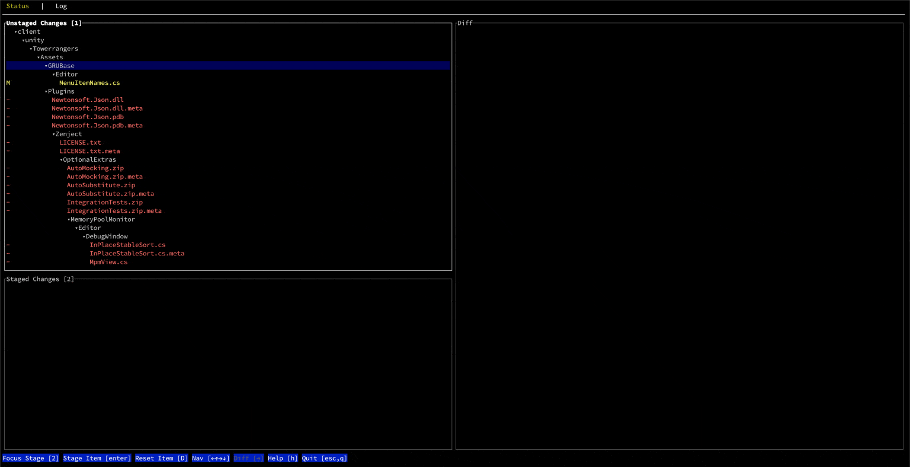

<h1 align="center">


[![CI][s0]][l0] [![crates][s1]][l1] ![MIT][s2] [![UNSAFE][s3]][l3] [![ITCH][s4]][l4] [![DISC][s5]][l5] [![TWEET][s6]][l6]

</h1>

[s0]: https://github.com/extrawurst/gitui/workflows/CI/badge.svg
[l0]: https://github.com/extrawurst/gitui/actions
[s1]: https://img.shields.io/crates/v/gitui.svg
[l1]: https://crates.io/crates/gitui
[s2]: https://img.shields.io/badge/license-MIT-blue.svg
[s3]: https://img.shields.io/badge/unsafe-forbidden-success.svg
[l3]: https://github.com/rust-secure-code/safety-dance/
[s4]: https://img.shields.io/badge/itch.io-ok-green
[l4]: https://extrawurst.itch.io/gitui
[s5]: https://img.shields.io/discord/723083834811220028.svg?logo=chat
[l5]: https://discord.gg/7TGFfuq
[s6]: https://img.shields.io/twitter/follow/extrawurst?label=follow&style=social
[l6]: https://twitter.com/intent/follow?screen_name=extrawurst

<h5 align="center">Blazing fast terminal client for git written in Rust</h1>



# Features

- Fast and intuitive **keyboard only** control
- Context based help (**no need to memorize** tons of hot-keys)
- Inspect, commit, and amend changes (incl. hooks: _commit-msg_/_post-commit_)
- Stage, unstage, revert and reset files and hunks
- Stashing (save, apply, drop, and inspect)
- Push to remote
- Browse commit log, diff committed changes
- Scalable terminal UI layout
- Async [input polling](assets/perf_compare.jpg)
- Async git API for fluid control

# Benchmarks

For a [RustBerlin meetup presentation](https://youtu.be/rpilJV-eIVw?t=5334) ([slides](https://github.com/extrawurst/gitui-presentation)) I compared `lazygit`,`tig` and `gitui` by parsing the entire Linux git repository (which contains over 900k commits):

|           | Time        | Memory (GB) | Binary (MB) | Freezes   | Crashes   |
| --------- | ----------- | ----------- | ----------- | --------- | --------- |
| `gitui`   | **24 s** ✅ | **0.17** ✅ | 1.4         | **No** ✅ | **No** ✅ |
| `lazygit` | 57 s        | 2.6         | 16          | Yes       | Sometimes |
| `tig`     | 4 m 20 s    | 1.3         | **0.6** ✅  | Sometimes | **No** ✅ |

# Motivation

I do most of my git usage in a terminal but I frequently found myself using git UIs for some use cases like: index, commit, diff, stash and log.

Over the last 2 years my go-to GUI tool for this was [fork](https://git-fork.com) because it was snappy, free, and not bloated. Unfortunately the _free_ part will [change soon](https://github.com/ForkIssues/TrackerWin/issues/571) and so I decided to build a fast and simple terminal tool myself to help do features I use the most.

# Known Limitations

- no support for `pull` yet (see [#90](https://github.com/extrawurst/gitui/issues/90))
- limited support for branching (see [#91](https://github.com/extrawurst/gitui/issues/91))
- no support for [bare repositories](https://git-scm.com/book/en/v2/Git-on-the-Server-Getting-Git-on-a-Server) (see [#100](https://github.com/extrawurst/gitui/issues/100))
- no support for [core.hooksPath](https://git-scm.com/docs/githooks) config

Currently, this tool does not fully substitute the _git shell_, however both tools work well in tandem.

`gitui` currently lacks essential features in git like push, pull, and checkout. The priorities are the basics (add, commit), and on features that are making me mad when done on the _git shell_, like stashes and hunks. Eventually, I will be able to work on features that could lead to making `gitui` a one stop solution to get rid of the shell entirely - but for that I need help - this is just a spare time project right now.

All support is welcomed! Sponsors as well! ❤️

# Installation

For the time being this product is in alpha and is not considered production ready. However, for personal use it is reasonably stable and is being used while developing itself.

### Arch Linux

There is an [AUR package](https://aur.archlinux.org/packages/gitui/) for `gitui`:

```sh
git clone https://aur.archlinux.org/gitui.git
cd gitui
makepkg -si
```

### Fedora

```sh
sudo dnf install gitui
```

### Homebrew (macOS)

```sh
brew install gitui
```

### [Scoop](https://github.com/ScoopInstaller/Main/blob/master/bucket/gitui.json) (Windows)

```
scoop install gitui
```

## Release Binaries

[Available for download in releases](https://github.com/extrawurst/gitui/releases)

Binaries available for:

- Linux
- macOS
- Windows

# Build

### Requirements

- Latest `rust` and `cargo`
  - See [Install Rust](https://www.rust-lang.org/tools/install)

### Cargo Install

The simplest way to start playing around with `gitui` is to have `cargo` build and install it with `cargo install gitui`

# Diagnostics

To run with logging enabled run `gitui -l`.

This will log to:

- macOS: `$HOME/Library/Caches/gitui/gitui.log`
- Linux using `XDG`: `$XDG_CACHE_HOME/gitui/gitui.log`
- Linux: `$HOME/.cache/gitui/gitui.log`

# Color Theme


`gitui` should automatically work on both light and dark terminal themes.

However, you can customize everything to your liking: See [Themes](THEMES.md).

# Key Bindings

The key bindings can be customized: See [Key Config](KEY_CONFIG.md) on how to set them to `vim`-like bindings.

# Inspiration

- [lazygit](https://github.com/jesseduffield/lazygit)
- [tig](https://github.com/jonas/tig)
- [GitUp](https://github.com/git-up/GitUp)
  - It would be nice to come up with a way to have the map view available in a terminal tool
- [git-brunch](https://github.com/andys8/git-brunch)
