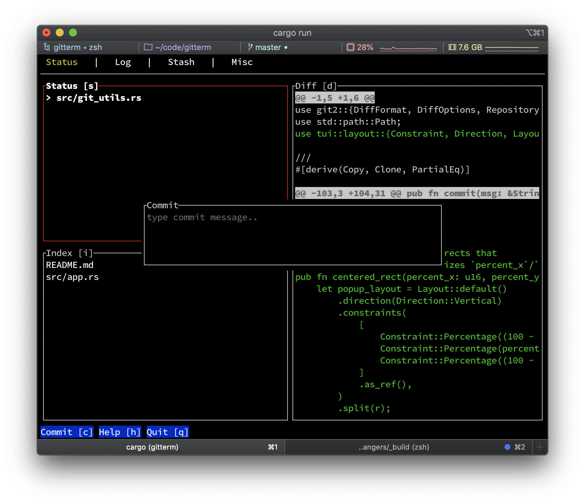

# gitui

 [![MIT][s2]][l2] 

[s2]: https://img.shields.io/badge/license-MIT-blue.svg
[l2]: LICENSE

blazing fast terminal-ui for git written in rust




## features

* fast key only control
* inspect changes
* (un)stage files
* revert/reset files
* commit changes
* async [input polling](assets/perf_compare.jpg) and 
* async git API for fluid control

## motivation

I do most of my git usage in a terminal but I frequently found myself using git UIs for some use cases like: index/commit, diff, stash and log.

Over the last 2 years my go-to GUI tool for this was [fork](https://git-fork.com) because it was not bloated, snappy and free. Unfortunately the *free* part will [change soon](https://github.com/ForkIssues/TrackerWin/issues/571) and so I decided to build a fast & simple terminal tool myself to copy the fork features i am using the most.

## installation

For the time being this product is considered alpha and not production ready, therefore I do not distribute binary versions yet, however feel free to build `gitui` and let me know what you think!

### requirements

install `rust`/`cargo`: https://www.rust-lang.org/tools/install

### build from source

the simplest way to start playing around with `gitui` is to have `cargo` install it locally:

```
cargo install --path "."
```

after that you can go to your git repo and run it:

```
gitui
```

# todo for 0.1 (first release)

* [ ] fix: no diff of untracked file in a subdir
* [ ] fix: dont show scrol option when any popup open
* [ ] fix: diff is not updated when changed
* [ ] fix: diff is updated when some hunks of the same file where diffed in unstaged before
* [ ] help command
* [ ] confirm destructive commands (revert/reset)
* [ ] (un)staging selected hunks
* [ ] publish as homebrew-tap
* [ ] release on crates.io

# alternatives

* https://github.com/jesseduffield/lazygit