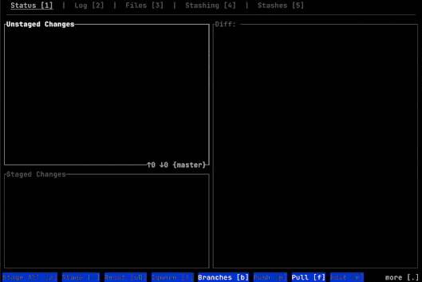

# filetreelist

This crate is designed as part of the [gitui](http://gitui.org) project.

`filetreelist` provides a very common functionality of `gitui`: lists of files visualized as a tree. It allows efficient iteration of only the visual (non collapsed) elements and change the tree state correctly given well defined inputs like `Up`/`Down`/`Collapse`.

It is the main driver behind the file tree feature:

